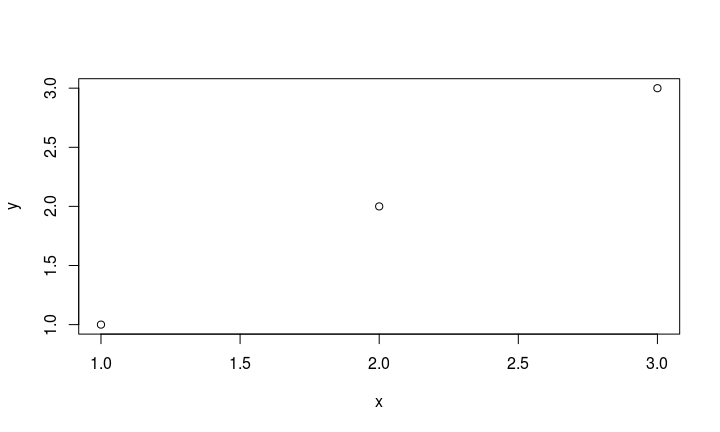
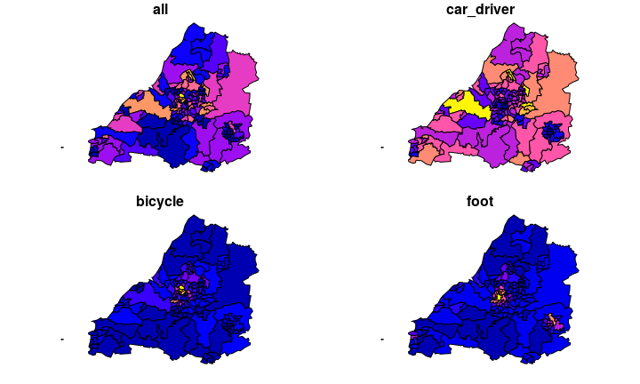
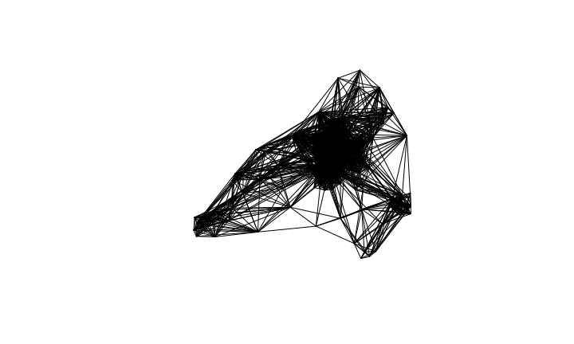
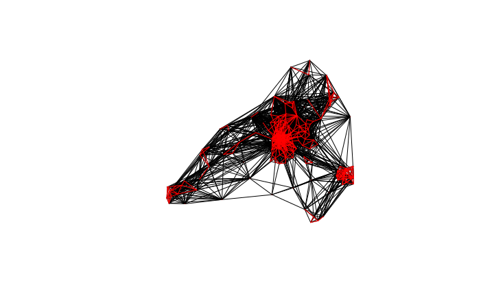
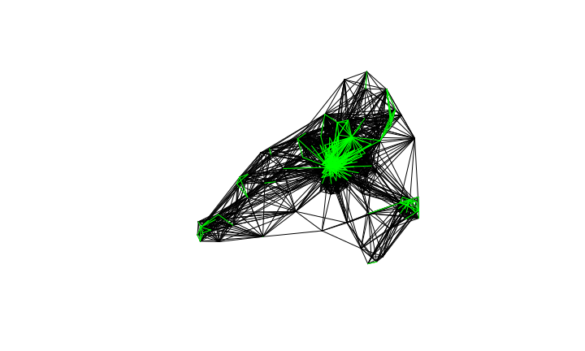
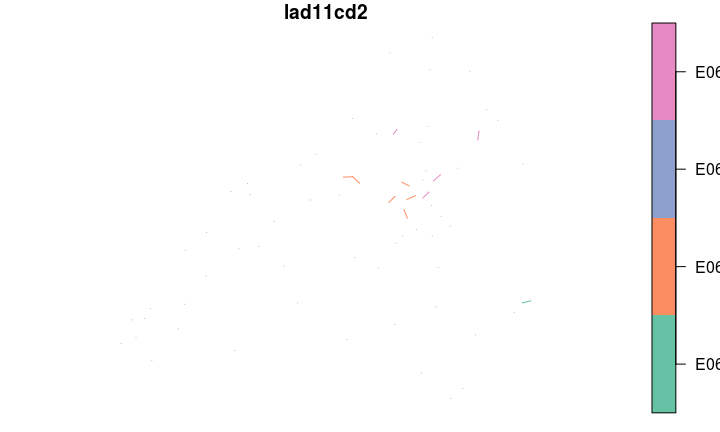
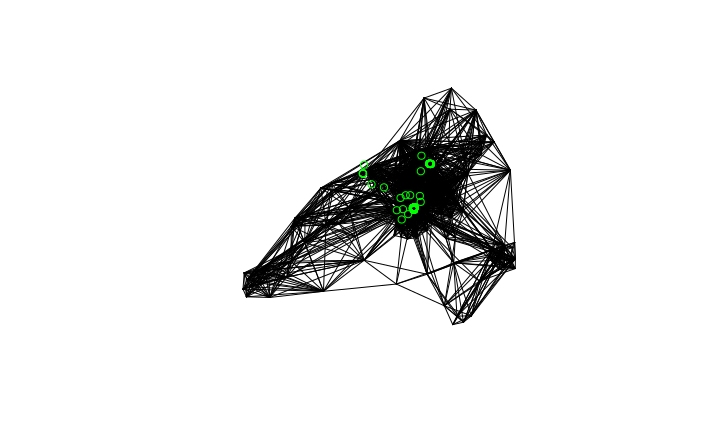

# R for Transport Applications: getting up-to-speed
Robin Lovelace, University of Leeds, 
 `r Sys.Date()`  
Slides: [rpubs.com/RobinLovelace](http://rpubs.com/RobinLovelace)  


## Why data carpentry?

<blockquote class="twitter-tweet" data-lang="en"><p lang="en" dir="ltr">Data analysts and &#39;scientists&#39;: don&#39;t wrangle, munge or &#39;hack&#39; your valuable datasets. Use <a href="https://twitter.com/hashtag/datacarpentry?src=hash">#datacarpentry</a>: <a href="https://t.co/gXrlIJH91R">https://t.co/gXrlIJH91R</a> <a href="https://t.co/GSWS7O7zBz">pic.twitter.com/GSWS7O7zBz</a></p>&mdash; Robin Lovelace (@robinlovelace) <a href="https://twitter.com/robinlovelace/status/833622374037721089">February 20, 2017</a></blockquote>
<script async src="//platform.twitter.com/widgets.js" charset="utf-8"></script>

- If you 'hack' or 'munge' data, it won't scale
- So ultimately it's about being able to handle Big Data
- We'll cover the basics of data frames and tibbles
- And the basics of **dplyr**, an excellent package for data carpentry
    - **dplyr** is also compatible with the **sf** package

## The data frame

The humble data frame is at the heart of most analysis projects:


```r
d = data.frame(x = 1:3, y = c("A", "B", "C"))
d
```

```
##   x y
## 1 1 A
## 2 2 B
## 3 3 C
```

In reality this is a list, making function work on each column:


```r
summary(d)
```

```
##        x       y    
##  Min.   :1.0   A:1  
##  1st Qu.:1.5   B:1  
##  Median :2.0   C:1  
##  Mean   :2.0        
##  3rd Qu.:2.5        
##  Max.   :3.0
```

```r
plot(d)
```

<!-- -->

## Subsetting

In base R, there are many ways to subset:


```r
d[1,] # the first line
```

```
##   x y
## 1 1 A
```

```r
d[,1] # the first column
```

```
## [1] 1 2 3
```

```r
d$x # the first column
```

```
## [1] 1 2 3
```

```r
d [1] # the first column, as a data frame
```

```
##   x
## 1 1
## 2 2
## 3 3
```

## The tibble

Recently the data frame has been extended:


```r
library("tibble")
dt = tibble(x = 1:3, y = c("A", "B", "C"))
dt
```

```
## # A tibble: 3 x 2
##       x     y
##   <int> <chr>
## 1     1     A
## 2     2     B
## 3     3     C
```

## Advantages of the tibble

It comes down to efficiency and usability

 - When printed, the tibble diff reports class
 - Character vectors are not coerced into factors
 - When printing a tibble diff to screen, only the first ten rows are displayed
 
## Practical prerequisites

You'll need the `efficient` package installed to run this next part:


```r
devtools::install_github("csgillespie/efficient")
library(efficient)
```

 
## dplyr

Like tibbles, has advantages over historic ways of doing things

- Type stability (data frame in, data frame out)
- Consistent functions - functions not `[` do everything
- Piping make complex operations easy


```r
ghg_ems %>%
  filter(!grepl("World|Europe", Country)) %>% 
  group_by(Country) %>% 
  summarise(Mean = mean(Transportation),
            Growth = diff(range(Transportation))) %>%
  top_n(3, Growth) %>%
  arrange(desc(Growth))
```

## Why pipes?


```r
wb_ineq %>% 
  filter(grepl("g", Country)) %>%
  group_by(Year) %>%
  summarise(gini = mean(gini, na.rm  = TRUE)) %>%
  arrange(desc(gini)) %>%
  top_n(n = 5)
```

vs


```r
top_n(
  arrange(
    summarise(
      group_by(
        filter(wb_ineq, grepl("g", Country)),
        Year),
      gini = mean(gini, na.rm  = TRUE)),
    desc(gini)),
  n = 5)
```

## Subsetting with dplyr

Only 1 way to do it, making life simpler:


```r
library(dplyr)
select(dt, x) # select columns
```

```
## # A tibble: 3 x 1
##       x
##   <int>
## 1     1
## 2     2
## 3     3
```

```r
slice(dt, 2) # 'slice' rows
```

```
## # A tibble: 1 x 2
##       x     y
##   <int> <chr>
## 1     2     B
```

## The nature of transport data

- The same as handling any other kind of data in R
- But: dynamic, complex (e.g. GTFS) reliant on official feeds
- That's why using a language that is powerful and flexible is good

## Types of transport data I

- Areal units: transport can be understood simply in terms of zonal aggregates such as the main mode and average distance of trips made people living in a particular zone.
- Nodes: these are points in the transport system that can represent common origins and destinations (e.g. with one centroid per zone) and public transport stations such as bus stops and rail stations.
- Desire lines: straight lines that represent 'origin-destination' data that records how many people travel (or could travel) between places (points or zones) in geographic space.

## Types of transport data II

- Routes: these are cirquitous (non-straight) routes, typically representing the 'optimal' path along the route network between origins and destinations along the desire lines defined in the previous bullet point.
- Route networks: these represent the system of roads, paths and other linear features in an area. They can be represented as purely geographic entities or as a graph.
Their features are segments which can be assigned values representing 'flow', the number of people expected to use a particular street or path.
- Agents: these are the lowest-level but hardest to model entities in transport systems --- mobile entities like you and me.

## Worked example: mode of travel in Bristol

- We'll load and visualise some transport data
- Get set-up with the pkgs:


```r
devtools::install_github("ropensci/stplanr", ref = "sfr") # dev version of stplanr
u = "https://github.com/Robinlovelace/GIS4TA-data/archive/master.zip"
download.file(u, destfile = "master.zip")
unzip("master.zip")
file.rename("GIS4TA-data-master", "GIS4TA-data")
```

## The libraries we'll use


```r
library(sf)
```

```
## Linking to GEOS 3.5.1, GDAL 2.2.1, proj.4 4.9.2, lwgeom 2.3.3 r15473
```

```r
library(stplanr)
```

```
## Loading required package: sp
```

```r
library(tidyverse)
```

```
## ── Attaching packages ────── tidyverse 1.2.0 ──
```

```
## ✔ ggplot2 2.2.1.9000     ✔ purrr   0.2.4     
## ✔ tidyr   0.7.2          ✔ stringr 1.2.0     
## ✔ readr   1.1.1          ✔ forcats 0.2.0
```

```
## ── Conflicts ───────── tidyverse_conflicts() ──
## ✖ dplyr::filter() masks stats::filter()
## ✖ dplyr::lag()    masks stats::lag()
```

## Load and inspect the zone data


```r
z = readRDS("GIS4TA-data/z.Rds")
z = st_as_sf(z) # convert to an sf object
plot(z[c("all", "car_driver", "bicycle", "foot")])
```

<!-- -->

## Download and preprocess the OD data


```r
od_data = read_csv("https://media.githubusercontent.com/media/npct/pct-outputs-regional-notR/master/commute/msoa/avon/od_attributes.csv")
od_data = od_data %>% filter(all > 50, geo_code1 %in% z$geo_code,
                             geo_code2 %in% z$geo_code) 
od_data$id = NULL
write_csv(od_data, "GIS4TA-data/od_attributes.csv")
```

## Convert OD data to geographical 'desire lines'


```r
od = read_csv("GIS4TA-data/od_attributes.csv")
l = od2line(flow = od, zones = z)
```

```
## Warning in st_centroid.sfc(st_geometry(x), of_largest_polygon =
## of_largest_polygon): st_centroid does not give correct centroids for
## longitude/latitude data
```

```r
plot(l$geometry)
```

<!-- -->

## Analysing where people walk


```r
sel_walk = l$foot > 19
l_walk = l[sel_walk,]
plot(l$geometry)
plot(l_walk, add = T, col = "red")
```

```
## Warning in plot.sf(l_walk, add = T, col = "red"): ignoring all but the
## first attribute
```

<!-- -->

## Subsetting in the tidyverse


```r
l_walk2 = l %>% 
  filter(bicycle > 19)
plot(l$geometry)
plot(l_walk2$geometry, add = T, col = "green")
```

<!-- -->

## From desire lines to routes

Let's find the cycling route for the top 3 cycled desire lines:


```r
l_cycle = l %>% top_n(n = 5, wt = bicycle)
odc = line2df(l_cycle)
r_cycle = viaroute(odc$fy, odc$fx, odc$ty, odc$tx) %>% 
  viaroute2sldf() %>% 
  st_as_sf()
```

> - What just happened?

## Plotting the result interactively


```r
library(tmap)
tmap_mode("view")
```

```
## tmap mode set to interactive viewing
```

```r
qtm(r_cycle)
```

<!--html_preserve--><div id="htmlwidget-92ed69d78a9f0faeef2f" style="width:720px;height:432px;" class="leaflet html-widget"></div>
<script type="application/json" data-for="htmlwidget-92ed69d78a9f0faeef2f">{"x":{"options":{"crs":{"crsClass":"L.CRS.EPSG3857","code":null,"proj4def":null,"projectedBounds":null,"options":{}}},"calls":[{"method":"addProviderTiles","args":["CartoDB.Positron",null,"CartoDB.Positron",{"minZoom":0,"maxZoom":18,"maxNativeZoom":null,"tileSize":256,"subdomains":"abc","errorTileUrl":"","tms":false,"continuousWorld":false,"noWrap":false,"zoomOffset":0,"zoomReverse":false,"opacity":1,"zIndex":null,"unloadInvisibleTiles":null,"updateWhenIdle":null,"detectRetina":false,"reuseTiles":false}]},{"method":"addProviderTiles","args":["OpenStreetMap",null,"OpenStreetMap",{"minZoom":0,"maxZoom":18,"maxNativeZoom":null,"tileSize":256,"subdomains":"abc","errorTileUrl":"","tms":false,"continuousWorld":false,"noWrap":false,"zoomOffset":0,"zoomReverse":false,"opacity":1,"zIndex":null,"unloadInvisibleTiles":null,"updateWhenIdle":null,"detectRetina":false,"reuseTiles":false}]},{"method":"addProviderTiles","args":["Esri.WorldTopoMap",null,"Esri.WorldTopoMap",{"minZoom":0,"maxZoom":18,"maxNativeZoom":null,"tileSize":256,"subdomains":"abc","errorTileUrl":"","tms":false,"continuousWorld":false,"noWrap":false,"zoomOffset":0,"zoomReverse":false,"opacity":1,"zIndex":null,"unloadInvisibleTiles":null,"updateWhenIdle":null,"detectRetina":false,"reuseTiles":false}]},{"method":"addPolylines","args":[[[[{"lng":[-2.58864,-2.589],"lat":[51.48015,51.48029]}]],[[{"lng":[-2.589,-2.58905,-2.58913,-2.58921,-2.58927,-2.58931,-2.58934,-2.58938,-2.58943,-2.5895,-2.58955,-2.58959,-2.5898,-2.58988,-2.59015,-2.59026,-2.59031,-2.59034,-2.59039,-2.5905,-2.59054,-2.59067,-2.59068,-2.59072,-2.59077,-2.59089,-2.59094,-2.59099,-2.59116,-2.59128,-2.59134,-2.59139,-2.59142,-2.59149,-2.59153,-2.59154,-2.59152,-2.59151,-2.59145,-2.59127,-2.59115,-2.59106,-2.59103,-2.59111,-2.59124,-2.59138,-2.5914,-2.59191,-2.59191,-2.59198,-2.59205,-2.59212,-2.59213,-2.59322,-2.59359,-2.59361,-2.59369,-2.59368],"lat":[51.48029,51.48024,51.48018,51.48007,51.48,51.47992,51.47987,51.47972,51.4795,51.47913,51.47891,51.4787,51.47815,51.47798,51.47725,51.47698,51.47686,51.47679,51.47664,51.47636,51.47626,51.47592,51.4758,51.4757,51.47562,51.47544,51.47537,51.47531,51.47519,51.47503,51.47495,51.47485,51.47475,51.47457,51.47438,51.47426,51.47397,51.47393,51.47381,51.47349,51.47331,51.47314,51.47302,51.4728,51.47262,51.47247,51.47245,51.47211,51.47207,51.47202,51.47197,51.47195,51.47194,51.47093,51.47052,51.4705,51.47037,51.47029]}]],[[{"lng":[-2.59368,-2.59368,-2.59363,-2.59355,-2.59348,-2.5933,-2.59318,-2.59313],"lat":[51.47029,51.47024,51.46993,51.4697,51.46957,51.46938,51.46922,51.46917]}]],[[{"lng":[-2.59313,-2.59315,-2.59323,-2.59344,-2.59373,-2.59387,-2.59397,-2.59408,-2.59418,-2.59425,-2.59429,-2.59431],"lat":[51.46917,51.46902,51.46898,51.46888,51.46865,51.46853,51.46842,51.46828,51.46812,51.46799,51.46793,51.46781]}]],[[{"lng":[-2.59431,-2.5943,-2.59429,-2.59428,-2.59429],"lat":[51.46781,51.4678,51.46779,51.46778,51.46777]}]],[[{"lng":[-2.59429,-2.59429,-2.59431,-2.59432,-2.59434,-2.59436],"lat":[51.46777,51.46775,51.46774,51.46773,51.46773,51.46773]}]],[[{"lng":[-2.59436,-2.59452,-2.59463,-2.59492,-2.59524,-2.59556,-2.59569,-2.59599,-2.5961,-2.59628,-2.59633],"lat":[51.46773,51.46756,51.46738,51.46696,51.46656,51.46622,51.46607,51.46552,51.46532,51.46488,51.46474]}]],[[{"lng":[-2.59633,-2.59641,-2.59649,-2.59659,-2.59664,-2.5967,-2.59683,-2.597,-2.59725,-2.59734,-2.59762,-2.5977,-2.59773,-2.59777,-2.59778,-2.59779,-2.59782,-2.59785,-2.59786,-2.59789,-2.59793,-2.59793,-2.59799,-2.59811],"lat":[51.46474,51.46448,51.46431,51.46415,51.46407,51.46399,51.46384,51.46362,51.46335,51.46324,51.46292,51.46279,51.46269,51.46231,51.46225,51.46218,51.46196,51.46176,51.4617,51.46155,51.46141,51.4614,51.46123,51.46085]}]],[[{"lng":[-2.59811,-2.5982,-2.59826,-2.59828,-2.59848,-2.5985,-2.59853,-2.59854,-2.59852,-2.5984,-2.59838,-2.59835,-2.5983,-2.59828,-2.59826,-2.59823,-2.59821,-2.59819,-2.59819,-2.5982,-2.5982,-2.59819,-2.59817,-2.59816],"lat":[51.46085,51.46065,51.46052,51.46043,51.45982,51.45976,51.45957,51.45943,51.45917,51.45883,51.45878,51.45867,51.45851,51.45842,51.45835,51.45826,51.45811,51.45792,51.45773,51.45751,51.45745,51.45741,51.45736,51.45734]}]],[[{"lng":[-2.59816,-2.59809,-2.59799,-2.5979,-2.59776,-2.59765,-2.59756],"lat":[51.45734,51.45726,51.45719,51.45712,51.45704,51.45698,51.45693]}]],[[{"lng":[-2.59756,-2.59767,-2.59787,-2.59805,-2.59814,-2.59824,-2.59843,-2.59852,-2.59871,-2.59888,-2.59924,-2.59947,-2.59955,-2.59971,-2.59982,-2.59999,-2.60012,-2.60068,-2.60083,-2.60099,-2.60112,-2.60143,-2.60158,-2.60161,-2.60166,-2.60178,-2.60198,-2.60204,-2.60219,-2.60229,-2.60244,-2.6027,-2.60296],"lat":[51.45693,51.45682,51.45662,51.45645,51.45638,51.4563,51.45618,51.45613,51.45604,51.45596,51.4558,51.4557,51.45566,51.45559,51.45556,51.45553,51.45551,51.45545,51.45543,51.45542,51.4554,51.45537,51.45536,51.45536,51.45536,51.45536,51.45536,51.45536,51.45537,51.45538,51.45541,51.45547,51.45553]}]],[[{"lng":[-2.60296,-2.60307,-2.60326,-2.60362],"lat":[51.45553,51.45542,51.45533,51.45515]}]],[[{"lng":[-2.60362,-2.60358,-2.6032,-2.60262,-2.6023,-2.6016,-2.60135,-2.60118,-2.60115,-2.60102],"lat":[51.45515,51.45512,51.45483,51.45438,51.45414,51.4536,51.4534,51.45327,51.45324,51.45314]}]],[[{"lng":[-2.60102,-2.60108,-2.60123,-2.60137,-2.60146,-2.60156,-2.60165,-2.60167],"lat":[51.45314,51.45311,51.45303,51.45296,51.45291,51.45284,51.45278,51.45276]}]],[[{"lng":[-2.60167,-2.6016699999],"lat":[51.45276,51.4527600001]}]],[[{"lng":[-2.6089,-2.60902,-2.60929,-2.60938,-2.60968,-2.61,-2.61012,-2.61038,-2.61047,-2.61055,-2.61066,-2.61074,-2.61091,-2.61094,-2.611,-2.61113,-2.61126,-2.6114,-2.61146,-2.61156,-2.61135,-2.6112,-2.61105,-2.61094,-2.61089,-2.61069],"lat":[51.47725,51.47717,51.47698,51.47691,51.47657,51.47617,51.47605,51.4758,51.47566,51.4754,51.47498,51.47464,51.474,51.47392,51.47378,51.47356,51.47339,51.47323,51.47318,51.47314,51.47297,51.47284,51.47273,51.47266,51.47263,51.47257]}]],[[{"lng":[-2.61069,-2.61063,-2.61056,-2.6105,-2.61045],"lat":[51.47257,51.47259,51.4726,51.47259,51.47256]}]],[[{"lng":[-2.61045,-2.61016,-2.60991,-2.60981,-2.6096,-2.60959,-2.60937,-2.60922,-2.60867,-2.60825,-2.60808,-2.60785,-2.60771,-2.60753,-2.60724,-2.607,-2.60689,-2.60679,-2.60672,-2.60664,-2.60643,-2.60622,-2.60602,-2.60579,-2.60551,-2.6049,-2.60465,-2.6044,-2.60431,-2.60415,-2.60385,-2.60295,-2.60247,-2.60202,-2.60176],"lat":[51.47256,51.47258,51.47254,51.4725,51.47242,51.47241,51.47232,51.47226,51.47198,51.47178,51.47171,51.47162,51.47157,51.47152,51.47145,51.47138,51.47134,51.47129,51.47123,51.47116,51.47092,51.47069,51.47055,51.47046,51.47038,51.4702,51.47015,51.47012,51.47011,51.4701,51.47009,51.47006,51.47003,51.46998,51.46995]}]],[[{"lng":[-2.60176,-2.60176,-2.60174,-2.60168,-2.60151,-2.60116,-2.60079,-2.6006,-2.60004,-2.5999,-2.59978,-2.59974,-2.59943,-2.59917,-2.59893,-2.59873,-2.5986,-2.59849,-2.59837,-2.59824,-2.59814],"lat":[51.46995,51.46991,51.46982,51.46974,51.46964,51.46943,51.46916,51.46898,51.4683,51.46811,51.46798,51.46794,51.46757,51.46729,51.46706,51.46689,51.46682,51.46676,51.46671,51.46661,51.46651]}]],[[{"lng":[-2.59814,-2.59737,-2.59686,-2.59633],"lat":[51.46651,51.46557,51.46489,51.46474]}]],[[{"lng":[-2.59633,-2.59641,-2.59649,-2.59659,-2.59664,-2.5967,-2.59683,-2.597,-2.59725,-2.59734,-2.59762,-2.5977,-2.59773,-2.59777,-2.59778,-2.59779,-2.59782,-2.59785,-2.59786,-2.59789,-2.59793,-2.59793,-2.59799,-2.59811],"lat":[51.46474,51.46448,51.46431,51.46415,51.46407,51.46399,51.46384,51.46362,51.46335,51.46324,51.46292,51.46279,51.46269,51.46231,51.46225,51.46218,51.46196,51.46176,51.4617,51.46155,51.46141,51.4614,51.46123,51.46085]}]],[[{"lng":[-2.59811,-2.5982,-2.59826,-2.59828,-2.59848,-2.5985,-2.59853,-2.59854,-2.59852,-2.5984,-2.59838,-2.59835,-2.5983,-2.59828,-2.59826,-2.59823,-2.59821,-2.59819,-2.59819,-2.5982,-2.5982,-2.59819,-2.59817,-2.59816],"lat":[51.46085,51.46065,51.46052,51.46043,51.45982,51.45976,51.45957,51.45943,51.45917,51.45883,51.45878,51.45867,51.45851,51.45842,51.45835,51.45826,51.45811,51.45792,51.45773,51.45751,51.45745,51.45741,51.45736,51.45734]}]],[[{"lng":[-2.59816,-2.59809,-2.59799,-2.5979,-2.59776,-2.59765,-2.59756],"lat":[51.45734,51.45726,51.45719,51.45712,51.45704,51.45698,51.45693]}]],[[{"lng":[-2.59756,-2.59767,-2.59787,-2.59805,-2.59814,-2.59824,-2.59843,-2.59852,-2.59871,-2.59888,-2.59924,-2.59947,-2.59955,-2.59971,-2.59982,-2.59999,-2.60012,-2.60068,-2.60083,-2.60099,-2.60112,-2.60143,-2.60158,-2.60161,-2.60166,-2.60178,-2.60198,-2.60204,-2.60219,-2.60229,-2.60244,-2.6027,-2.60296],"lat":[51.45693,51.45682,51.45662,51.45645,51.45638,51.4563,51.45618,51.45613,51.45604,51.45596,51.4558,51.4557,51.45566,51.45559,51.45556,51.45553,51.45551,51.45545,51.45543,51.45542,51.4554,51.45537,51.45536,51.45536,51.45536,51.45536,51.45536,51.45536,51.45537,51.45538,51.45541,51.45547,51.45553]}]],[[{"lng":[-2.60296,-2.60307,-2.60326,-2.60362],"lat":[51.45553,51.45542,51.45533,51.45515]}]],[[{"lng":[-2.60362,-2.60358,-2.6032,-2.60262,-2.6023,-2.6016,-2.60135,-2.60118,-2.60115,-2.60102],"lat":[51.45515,51.45512,51.45483,51.45438,51.45414,51.4536,51.4534,51.45327,51.45324,51.45314]}]],[[{"lng":[-2.60102,-2.60108,-2.60123,-2.60137,-2.60146,-2.60156,-2.60165,-2.60167],"lat":[51.45314,51.45311,51.45303,51.45296,51.45291,51.45284,51.45278,51.45276]}]],[[{"lng":[-2.60167,-2.6016699999],"lat":[51.45276,51.4527600001]}]],[[{"lng":[-2.59084,-2.59096,-2.59118,-2.59132,-2.59147,-2.5916,-2.59219,-2.59263,-2.59271,-2.59275,-2.59273,-2.59272,-2.59265],"lat":[51.47226,51.47211,51.47193,51.47185,51.47178,51.47168,51.4709,51.47023,51.47005,51.46981,51.46968,51.46966,51.46952]}]],[[{"lng":[-2.59265,-2.59272,-2.59278,-2.59283,-2.59288,-2.59292],"lat":[51.46952,51.46948,51.46943,51.4693,51.46909,51.46895]}]],[[{"lng":[-2.59292,-2.59298,-2.59315],"lat":[51.46895,51.46891,51.46902]}]],[[{"lng":[-2.59315,-2.59323,-2.59344,-2.59373,-2.59387,-2.59397,-2.59408,-2.59418,-2.59425,-2.59429,-2.59431],"lat":[51.46902,51.46898,51.46888,51.46865,51.46853,51.46842,51.46828,51.46812,51.46799,51.46793,51.46781]}]],[[{"lng":[-2.59431,-2.5943,-2.59429,-2.59428,-2.59429],"lat":[51.46781,51.4678,51.46779,51.46778,51.46777]}]],[[{"lng":[-2.59429,-2.59429,-2.59431,-2.59432,-2.59434,-2.59436],"lat":[51.46777,51.46775,51.46774,51.46773,51.46773,51.46773]}]],[[{"lng":[-2.59436,-2.59452,-2.59463,-2.59492,-2.59524,-2.59556,-2.59569,-2.59599,-2.5961,-2.59628,-2.59633],"lat":[51.46773,51.46756,51.46738,51.46696,51.46656,51.46622,51.46607,51.46552,51.46532,51.46488,51.46474]}]],[[{"lng":[-2.59633,-2.59641,-2.59649,-2.59659,-2.59664,-2.5967,-2.59683,-2.597,-2.59725,-2.59734,-2.59762,-2.5977,-2.59773,-2.59777,-2.59778,-2.59779,-2.59782,-2.59785,-2.59786,-2.59789,-2.59793,-2.59793,-2.59799,-2.59811],"lat":[51.46474,51.46448,51.46431,51.46415,51.46407,51.46399,51.46384,51.46362,51.46335,51.46324,51.46292,51.46279,51.46269,51.46231,51.46225,51.46218,51.46196,51.46176,51.4617,51.46155,51.46141,51.4614,51.46123,51.46085]}]],[[{"lng":[-2.59811,-2.5982,-2.59826,-2.59828,-2.59848,-2.5985,-2.59853,-2.59854,-2.59852,-2.5984,-2.59838,-2.59835,-2.5983,-2.59828,-2.59826,-2.59823,-2.59821,-2.59819,-2.59819,-2.5982,-2.5982,-2.59819,-2.59817,-2.59816],"lat":[51.46085,51.46065,51.46052,51.46043,51.45982,51.45976,51.45957,51.45943,51.45917,51.45883,51.45878,51.45867,51.45851,51.45842,51.45835,51.45826,51.45811,51.45792,51.45773,51.45751,51.45745,51.45741,51.45736,51.45734]}]],[[{"lng":[-2.59816,-2.59809,-2.59799,-2.5979,-2.59776,-2.59765,-2.59756],"lat":[51.45734,51.45726,51.45719,51.45712,51.45704,51.45698,51.45693]}]],[[{"lng":[-2.59756,-2.59767,-2.59787,-2.59805,-2.59814,-2.59824,-2.59843,-2.59852,-2.59871,-2.59888,-2.59924,-2.59947,-2.59955,-2.59971,-2.59982,-2.59999,-2.60012,-2.60068,-2.60083,-2.60099,-2.60112,-2.60143,-2.60158,-2.60161,-2.60166,-2.60178,-2.60198,-2.60204,-2.60219,-2.60229,-2.60244,-2.6027,-2.60296],"lat":[51.45693,51.45682,51.45662,51.45645,51.45638,51.4563,51.45618,51.45613,51.45604,51.45596,51.4558,51.4557,51.45566,51.45559,51.45556,51.45553,51.45551,51.45545,51.45543,51.45542,51.4554,51.45537,51.45536,51.45536,51.45536,51.45536,51.45536,51.45536,51.45537,51.45538,51.45541,51.45547,51.45553]}]],[[{"lng":[-2.60296,-2.60307,-2.60326,-2.60362],"lat":[51.45553,51.45542,51.45533,51.45515]}]],[[{"lng":[-2.60362,-2.60358,-2.6032,-2.60262,-2.6023,-2.6016,-2.60135,-2.60118,-2.60115,-2.60102],"lat":[51.45515,51.45512,51.45483,51.45438,51.45414,51.4536,51.4534,51.45327,51.45324,51.45314]}]],[[{"lng":[-2.60102,-2.60108,-2.60123,-2.60137,-2.60146,-2.60156,-2.60165,-2.60167],"lat":[51.45314,51.45311,51.45303,51.45296,51.45291,51.45284,51.45278,51.45276]}]],[[{"lng":[-2.60167,-2.6016699999],"lat":[51.45276,51.4527600001]}]],[[{"lng":[-2.58104,-2.581,-2.58095,-2.5808],"lat":[51.46632,51.46623,51.46611,51.46597]}]],[[{"lng":[-2.5808,-2.58103,-2.58163,-2.58179,-2.58252,-2.58302,-2.58316,-2.58331,-2.58358,-2.58394,-2.58431,-2.58512,-2.58621,-2.58634,-2.58648,-2.58665,-2.5867,-2.58686,-2.58735,-2.58796,-2.58807,-2.58828,-2.58923,-2.58949,-2.58973],"lat":[51.46597,51.46589,51.46569,51.46564,51.46546,51.46536,51.46534,51.46532,51.46532,51.46529,51.46528,51.46527,51.46526,51.46525,51.46523,51.46517,51.46515,51.46509,51.46489,51.46465,51.46462,51.46457,51.46435,51.46428,51.46423]}]],[[{"lng":[-2.58973,-2.58974,-2.58974,-2.58976,-2.58987,-2.58994,-2.58995],"lat":[51.46423,51.46409,51.46399,51.4638,51.46324,51.46291,51.46286]}]],[[{"lng":[-2.58995,-2.59007,-2.59013,-2.59102,-2.59145,-2.59194,-2.59216],"lat":[51.46286,51.46281,51.46277,51.46222,51.46192,51.46155,51.4614]}]],[[{"lng":[-2.59216,-2.5924,-2.59298,-2.59363,-2.59376,-2.59385,-2.59394,-2.59399],"lat":[51.4614,51.46123,51.4608,51.46036,51.46024,51.46013,51.45994,51.45983]}]],[[{"lng":[-2.59399,-2.59415,-2.59438,-2.59458,-2.59474,-2.5948,-2.59526,-2.59547,-2.59551,-2.59554],"lat":[51.45983,51.4598,51.45975,51.45966,51.45957,51.45954,51.45921,51.45905,51.45902,51.459]}]],[[{"lng":[-2.59554,-2.59591,-2.59599,-2.5963,-2.59641,-2.59657,-2.59664,-2.59673,-2.59715,-2.59745,-2.59747,-2.59756],"lat":[51.459,51.4587,51.45861,51.45827,51.45816,51.458,51.45791,51.45781,51.45737,51.45705,51.45702,51.45693]}]],[[{"lng":[-2.59756,-2.59767,-2.59787,-2.59805,-2.59814,-2.59824,-2.59843,-2.59852,-2.59871,-2.59888,-2.59924,-2.59947,-2.59955,-2.59971,-2.59982,-2.59999,-2.60012,-2.60068,-2.60083,-2.60099,-2.60112,-2.60143,-2.60158,-2.60161,-2.60166,-2.60178,-2.60198,-2.60204,-2.60219,-2.60229,-2.60244,-2.6027,-2.60296],"lat":[51.45693,51.45682,51.45662,51.45645,51.45638,51.4563,51.45618,51.45613,51.45604,51.45596,51.4558,51.4557,51.45566,51.45559,51.45556,51.45553,51.45551,51.45545,51.45543,51.45542,51.4554,51.45537,51.45536,51.45536,51.45536,51.45536,51.45536,51.45536,51.45537,51.45538,51.45541,51.45547,51.45553]}]],[[{"lng":[-2.60296,-2.60307,-2.60326,-2.60362],"lat":[51.45553,51.45542,51.45533,51.45515]}]],[[{"lng":[-2.60362,-2.60358,-2.6032,-2.60262,-2.6023,-2.6016,-2.60135,-2.60118,-2.60115,-2.60102],"lat":[51.45515,51.45512,51.45483,51.45438,51.45414,51.4536,51.4534,51.45327,51.45324,51.45314]}]],[[{"lng":[-2.60102,-2.60108,-2.60123,-2.60137,-2.60146,-2.60156,-2.60165,-2.60167],"lat":[51.45314,51.45311,51.45303,51.45296,51.45291,51.45284,51.45278,51.45276]}]],[[{"lng":[-2.60167,-2.6016699999],"lat":[51.45276,51.4527600001]}]],[[{"lng":[-2.60167,-2.60172,-2.60179,-2.60183,-2.60187,-2.6019,-2.60192,-2.60194,-2.60194,-2.60193,-2.60191,-2.60187,-2.60186,-2.60185],"lat":[51.45276,51.45271,51.45263,51.45258,51.4525,51.45244,51.45235,51.45227,51.45218,51.45209,51.45203,51.45191,51.45188,51.45184]}]],[[{"lng":[-2.60185,-2.60184,-2.60181,-2.60179,-2.60177,-2.60176,-2.60175,-2.60176,-2.60178,-2.6018,-2.60182,-2.60184,-2.60186,-2.60189,-2.6019,-2.60238,-2.60318,-2.60433],"lat":[51.45184,51.45184,51.45184,51.45184,51.45182,51.45181,51.45179,51.45177,51.45176,51.45175,51.45175,51.45175,51.45175,51.45176,51.45177,51.4517,51.45156,51.45137]}]],[[{"lng":[-2.60433,-2.60474,-2.60485,-2.60493,-2.60509,-2.60545,-2.60578,-2.60618,-2.60623,-2.60705,-2.60719,-2.60733,-2.60746,-2.60754],"lat":[51.45137,51.45131,51.4513,51.45128,51.45124,51.45113,51.45103,51.45096,51.45095,51.45082,51.45078,51.45074,51.4507,51.45069]}]],[[{"lng":[-2.60754,-2.6076,-2.60765,-2.60773,-2.60777,-2.60783],"lat":[51.45069,51.45064,51.45062,51.45059,51.45058,51.45058]}]],[[{"lng":[-2.60783,-2.60805,-2.60821,-2.60843,-2.60871,-2.60881,-2.60937,-2.60984,-2.61219,-2.61241,-2.61274,-2.61325,-2.61331,-2.61371,-2.6138,-2.6139,-2.61426,-2.61441,-2.6146,-2.61494,-2.61569,-2.61614,-2.61639,-2.61656,-2.61682,-2.61701,-2.61723,-2.6174,-2.61756,-2.61771,-2.61783,-2.61797,-2.6181,-2.61822],"lat":[51.45058,51.45053,51.45051,51.45049,51.45045,51.45042,51.45029,51.45019,51.44964,51.44961,51.44957,51.44953,51.44952,51.44949,51.44949,51.44951,51.44958,51.44961,51.44965,51.44972,51.44983,51.4499,51.44988,51.44988,51.44985,51.44984,51.44986,51.44989,51.44991,51.44995,51.44995,51.44992,51.44983,51.44971]}]],[[{"lng":[-2.61822,-2.61824,-2.61829,-2.61833,-2.6184,-2.61858],"lat":[51.44971,51.44966,51.44952,51.44941,51.44924,51.44874]}]],[[{"lng":[-2.61858,-2.61872,-2.61883,-2.61899,-2.61909,-2.61922],"lat":[51.44874,51.44857,51.44851,51.44848,51.44848,51.44849]}]],[[{"lng":[-2.61922,-2.61952,-2.61986,-2.62058,-2.62102,-2.62135,-2.62162,-2.62192],"lat":[51.44849,51.4486,51.44869,51.44891,51.44903,51.4491,51.44909,51.44904]}]],[[{"lng":[-2.62192,-2.62207,-2.6222,-2.62268,-2.62278,-2.62311,-2.62324,-2.62352,-2.62379,-2.62395,-2.62404,-2.62408,-2.6241,-2.62411,-2.62411,-2.6241,-2.62405,-2.62397,-2.62387,-2.62376,-2.62356,-2.62336,-2.62305],"lat":[51.44904,51.44895,51.44886,51.44825,51.44811,51.44769,51.44751,51.44716,51.44681,51.44659,51.44642,51.44634,51.44625,51.44614,51.44611,51.44597,51.44584,51.44571,51.44559,51.44547,51.44528,51.4451,51.44483]}]],[[{"lng":[-2.62305,-2.62278,-2.6226,-2.62248,-2.62215,-2.62128,-2.62055,-2.62038,-2.62005,-2.61945],"lat":[51.44483,51.4447,51.44464,51.44461,51.44455,51.44445,51.44437,51.44435,51.44434,51.44431]}]],[[{"lng":[-2.61945,-2.6199],"lat":[51.44431,51.44428]}]],[[{"lng":[-2.6199,-2.61989,-2.61984,-2.61884],"lat":[51.44428,51.44423,51.44418,51.44361]}]],[[{"lng":[-2.61884,-2.6188399999],"lat":[51.44361,51.4436100001]}]]],1,"r_cycle",{"lineCap":null,"lineJoin":null,"clickable":true,"pointerEvents":null,"className":"","stroke":true,"color":["#FF0000","#FF0000","#FF0000","#FF0000","#FF0000","#FF0000","#FF0000","#FF0000","#FF0000","#FF0000","#FF0000","#FF0000","#FF0000","#FF0000","#FF0000","#FF0000","#FF0000","#FF0000","#FF0000","#FF0000","#FF0000","#FF0000","#FF0000","#FF0000","#FF0000","#FF0000","#FF0000","#FF0000","#FF0000","#FF0000","#FF0000","#FF0000","#FF0000","#FF0000","#FF0000","#FF0000","#FF0000","#FF0000","#FF0000","#FF0000","#FF0000","#FF0000","#FF0000","#FF0000","#FF0000","#FF0000","#FF0000","#FF0000","#FF0000","#FF0000","#FF0000","#FF0000","#FF0000","#FF0000","#FF0000","#FF0000","#FF0000","#FF0000","#FF0000","#FF0000","#FF0000","#FF0000","#FF0000","#FF0000","#FF0000","#FF0000","#FF0000","#FF0000"],"weight":[1,1,1,1,1,1,1,1,1,1,1,1,1,1,1,1,1,1,1,1,1,1,1,1,1,1,1,1,1,1,1,1,1,1,1,1,1,1,1,1,1,1,1,1,1,1,1,1,1,1,1,1,1,1,1,1,1,1,1,1,1,1,1,1,1,1,1,1],"opacity":[0.7,0.7,0.7,0.7,0.7,0.7,0.7,0.7,0.7,0.7,0.7,0.7,0.7,0.7,0.7,0.7,0.7,0.7,0.7,0.7,0.7,0.7,0.7,0.7,0.7,0.7,0.7,0.7,0.7,0.7,0.7,0.7,0.7,0.7,0.7,0.7,0.7,0.7,0.7,0.7,0.7,0.7,0.7,0.7,0.7,0.7,0.7,0.7,0.7,0.7,0.7,0.7,0.7,0.7,0.7,0.7,0.7,0.7,0.7,0.7,0.7,0.7,0.7,0.7,0.7,0.7,0.7,0.7],"fill":false,"fillColor":["#FF0000","#FF0000","#FF0000","#FF0000","#FF0000","#FF0000","#FF0000","#FF0000","#FF0000","#FF0000","#FF0000","#FF0000","#FF0000","#FF0000","#FF0000","#FF0000","#FF0000","#FF0000","#FF0000","#FF0000","#FF0000","#FF0000","#FF0000","#FF0000","#FF0000","#FF0000","#FF0000","#FF0000","#FF0000","#FF0000","#FF0000","#FF0000","#FF0000","#FF0000","#FF0000","#FF0000","#FF0000","#FF0000","#FF0000","#FF0000","#FF0000","#FF0000","#FF0000","#FF0000","#FF0000","#FF0000","#FF0000","#FF0000","#FF0000","#FF0000","#FF0000","#FF0000","#FF0000","#FF0000","#FF0000","#FF0000","#FF0000","#FF0000","#FF0000","#FF0000","#FF0000","#FF0000","#FF0000","#FF0000","#FF0000","#FF0000","#FF0000","#FF0000"],"fillOpacity":0.2,"dashArray":"none","smoothFactor":1,"noClip":false},["<div style=\"max-height:10em;overflow:auto;\"><table>\n\t\t\t   <thead><tr><th colspan=\"2\"><\/th><\/thead><\/tr><tr><td style=\"color: #888888;\">routenum<\/td><td>1<\/td><\/tr><tr><td style=\"color: #888888;\">legnum<\/td><td>1<\/td><\/tr><tr><td style=\"color: #888888;\">routedesc<\/td><td>Gloucester Road, Cotham Brow<\/td><\/tr><tr><td style=\"color: #888888;\">streetname<\/td><td>Nevil Road<\/td><\/tr><tr><td style=\"color: #888888;\">bearing_after<\/td><td>302<\/td><\/tr><tr><td style=\"color: #888888;\">bearing_before<\/td><td>0<\/td><\/tr><tr><td style=\"color: #888888;\">type<\/td><td>depart<\/td><\/tr><tr><td style=\"color: #888888;\">modifier<\/td><td>left<\/td><\/tr><tr><td style=\"color: #888888;\">exit<\/td><td>NA<\/td><\/tr><tr><td style=\"color: #888888;\">duration<\/td><td>14.4<\/td><\/tr><tr><td style=\"color: #888888;\">distance<\/td><td>29.6<\/td><\/tr><tr><td style=\"color: #888888;\">destination<\/td><td>NA<\/td><\/tr><\/table><\/div>","<div style=\"max-height:10em;overflow:auto;\"><table>\n\t\t\t   <thead><tr><th colspan=\"2\"><\/th><\/thead><\/tr><tr><td style=\"color: #888888;\">routenum<\/td><td>1<\/td><\/tr><tr><td style=\"color: #888888;\">legnum<\/td><td>1<\/td><\/tr><tr><td style=\"color: #888888;\">routedesc<\/td><td>Gloucester Road, Cotham Brow<\/td><\/tr><tr><td style=\"color: #888888;\">streetname<\/td><td>Gloucester Road<\/td><\/tr><tr><td style=\"color: #888888;\">bearing_after<\/td><td>216<\/td><\/tr><tr><td style=\"color: #888888;\">bearing_before<\/td><td>300<\/td><\/tr><tr><td style=\"color: #888888;\">type<\/td><td>turn<\/td><\/tr><tr><td style=\"color: #888888;\">modifier<\/td><td>left<\/td><\/tr><tr><td style=\"color: #888888;\">exit<\/td><td>NA<\/td><\/tr><tr><td style=\"color: #888888;\">duration<\/td><td>261.6<\/td><\/tr><tr><td style=\"color: #888888;\">distance<\/td><td>1,204.1<\/td><\/tr><tr><td style=\"color: #888888;\">destination<\/td><td>NA<\/td><\/tr><\/table><\/div>","<div style=\"max-height:10em;overflow:auto;\"><table>\n\t\t\t   <thead><tr><th colspan=\"2\"><\/th><\/thead><\/tr><tr><td style=\"color: #888888;\">routenum<\/td><td>1<\/td><\/tr><tr><td style=\"color: #888888;\">legnum<\/td><td>1<\/td><\/tr><tr><td style=\"color: #888888;\">routedesc<\/td><td>Gloucester Road, Cotham Brow<\/td><\/tr><tr><td style=\"color: #888888;\">streetname<\/td><td>Cheltenham Road<\/td><\/tr><tr><td style=\"color: #888888;\">bearing_after<\/td><td>175<\/td><\/tr><tr><td style=\"color: #888888;\">bearing_before<\/td><td>178<\/td><\/tr><tr><td style=\"color: #888888;\">type<\/td><td>new name<\/td><\/tr><tr><td style=\"color: #888888;\">modifier<\/td><td>straight<\/td><\/tr><tr><td style=\"color: #888888;\">exit<\/td><td>NA<\/td><\/tr><tr><td style=\"color: #888888;\">duration<\/td><td>29.7<\/td><\/tr><tr><td style=\"color: #888888;\">distance<\/td><td>132.8<\/td><\/tr><tr><td style=\"color: #888888;\">destination<\/td><td>NA<\/td><\/tr><\/table><\/div>","<div style=\"max-height:10em;overflow:auto;\"><table>\n\t\t\t   <thead><tr><th colspan=\"2\"><\/th><\/thead><\/tr><tr><td style=\"color: #888888;\">routenum<\/td><td>1<\/td><\/tr><tr><td style=\"color: #888888;\">legnum<\/td><td>1<\/td><\/tr><tr><td style=\"color: #888888;\">routedesc<\/td><td>Gloucester Road, Cotham Brow<\/td><\/tr><tr><td style=\"color: #888888;\">streetname<\/td><td>Cotham Brow<\/td><\/tr><tr><td style=\"color: #888888;\">bearing_after<\/td><td>184<\/td><\/tr><tr><td style=\"color: #888888;\">bearing_before<\/td><td>150<\/td><\/tr><tr><td style=\"color: #888888;\">type<\/td><td>turn<\/td><\/tr><tr><td style=\"color: #888888;\">modifier<\/td><td>right<\/td><\/tr><tr><td style=\"color: #888888;\">exit<\/td><td>NA<\/td><\/tr><tr><td style=\"color: #888888;\">duration<\/td><td>34.1<\/td><\/tr><tr><td style=\"color: #888888;\">distance<\/td><td>176.9<\/td><\/tr><tr><td style=\"color: #888888;\">destination<\/td><td>NA<\/td><\/tr><\/table><\/div>","<div style=\"max-height:10em;overflow:auto;\"><table>\n\t\t\t   <thead><tr><th colspan=\"2\"><\/th><\/thead><\/tr><tr><td style=\"color: #888888;\">routenum<\/td><td>1<\/td><\/tr><tr><td style=\"color: #888888;\">legnum<\/td><td>1<\/td><\/tr><tr><td style=\"color: #888888;\">routedesc<\/td><td>Gloucester Road, Cotham Brow<\/td><\/tr><tr><td style=\"color: #888888;\">streetname<\/td><td>Cotham Brow<\/td><\/tr><tr><td style=\"color: #888888;\">bearing_after<\/td><td>160<\/td><\/tr><tr><td style=\"color: #888888;\">bearing_before<\/td><td>195<\/td><\/tr><tr><td style=\"color: #888888;\">type<\/td><td>continue<\/td><\/tr><tr><td style=\"color: #888888;\">modifier<\/td><td>slight left<\/td><\/tr><tr><td style=\"color: #888888;\">exit<\/td><td>NA<\/td><\/tr><tr><td style=\"color: #888888;\">duration<\/td><td>1.5<\/td><\/tr><tr><td style=\"color: #888888;\">distance<\/td><td>5.5<\/td><\/tr><tr><td style=\"color: #888888;\">destination<\/td><td>NA<\/td><\/tr><\/table><\/div>","<div style=\"max-height:10em;overflow:auto;\"><table>\n\t\t\t   <thead><tr><th colspan=\"2\"><\/th><\/thead><\/tr><tr><td style=\"color: #888888;\">routenum<\/td><td>1<\/td><\/tr><tr><td style=\"color: #888888;\">legnum<\/td><td>1<\/td><\/tr><tr><td style=\"color: #888888;\">routedesc<\/td><td>Gloucester Road, Cotham Brow<\/td><\/tr><tr><td style=\"color: #888888;\">streetname<\/td><td>Cotham Brow<\/td><\/tr><tr><td style=\"color: #888888;\">bearing_after<\/td><td>215<\/td><\/tr><tr><td style=\"color: #888888;\">bearing_before<\/td><td>160<\/td><\/tr><tr><td style=\"color: #888888;\">type<\/td><td>continue<\/td><\/tr><tr><td style=\"color: #888888;\">modifier<\/td><td>right<\/td><\/tr><tr><td style=\"color: #888888;\">exit<\/td><td>NA<\/td><\/tr><tr><td style=\"color: #888888;\">duration<\/td><td>1.9<\/td><\/tr><tr><td style=\"color: #888888;\">distance<\/td><td>7.0<\/td><\/tr><tr><td style=\"color: #888888;\">destination<\/td><td>NA<\/td><\/tr><\/table><\/div>","<div style=\"max-height:10em;overflow:auto;\"><table>\n\t\t\t   <thead><tr><th colspan=\"2\"><\/th><\/thead><\/tr><tr><td style=\"color: #888888;\">routenum<\/td><td>1<\/td><\/tr><tr><td style=\"color: #888888;\">legnum<\/td><td>1<\/td><\/tr><tr><td style=\"color: #888888;\">routedesc<\/td><td>Gloucester Road, Cotham Brow<\/td><\/tr><tr><td style=\"color: #888888;\">streetname<\/td><td>Cotham Brow<\/td><\/tr><tr><td style=\"color: #888888;\">bearing_after<\/td><td>203<\/td><\/tr><tr><td style=\"color: #888888;\">bearing_before<\/td><td>253<\/td><\/tr><tr><td style=\"color: #888888;\">type<\/td><td>continue<\/td><\/tr><tr><td style=\"color: #888888;\">modifier<\/td><td>left<\/td><\/tr><tr><td style=\"color: #888888;\">exit<\/td><td>NA<\/td><\/tr><tr><td style=\"color: #888888;\">duration<\/td><td>43.2<\/td><\/tr><tr><td style=\"color: #888888;\">distance<\/td><td>361.3<\/td><\/tr><tr><td style=\"color: #888888;\">destination<\/td><td>NA<\/td><\/tr><\/table><\/div>","<div style=\"max-height:10em;overflow:auto;\"><table>\n\t\t\t   <thead><tr><th colspan=\"2\"><\/th><\/thead><\/tr><tr><td style=\"color: #888888;\">routenum<\/td><td>1<\/td><\/tr><tr><td style=\"color: #888888;\">legnum<\/td><td>1<\/td><\/tr><tr><td style=\"color: #888888;\">routedesc<\/td><td>Gloucester Road, Cotham Brow<\/td><\/tr><tr><td style=\"color: #888888;\">streetname<\/td><td>Cotham Road<\/td><\/tr><tr><td style=\"color: #888888;\">bearing_after<\/td><td>189<\/td><\/tr><tr><td style=\"color: #888888;\">bearing_before<\/td><td>191<\/td><\/tr><tr><td style=\"color: #888888;\">type<\/td><td>new name<\/td><\/tr><tr><td style=\"color: #888888;\">modifier<\/td><td>straight<\/td><\/tr><tr><td style=\"color: #888888;\">exit<\/td><td>NA<\/td><\/tr><tr><td style=\"color: #888888;\">duration<\/td><td>53.9<\/td><\/tr><tr><td style=\"color: #888888;\">distance<\/td><td>456.4<\/td><\/tr><tr><td style=\"color: #888888;\">destination<\/td><td>NA<\/td><\/tr><\/table><\/div>","<div style=\"max-height:10em;overflow:auto;\"><table>\n\t\t\t   <thead><tr><th colspan=\"2\"><\/th><\/thead><\/tr><tr><td style=\"color: #888888;\">routenum<\/td><td>1<\/td><\/tr><tr><td style=\"color: #888888;\">legnum<\/td><td>1<\/td><\/tr><tr><td style=\"color: #888888;\">routedesc<\/td><td>Gloucester Road, Cotham Brow<\/td><\/tr><tr><td style=\"color: #888888;\">streetname<\/td><td>Horfield Road<\/td><\/tr><tr><td style=\"color: #888888;\">bearing_after<\/td><td>195<\/td><\/tr><tr><td style=\"color: #888888;\">bearing_before<\/td><td>191<\/td><\/tr><tr><td style=\"color: #888888;\">type<\/td><td>new name<\/td><\/tr><tr><td style=\"color: #888888;\">modifier<\/td><td>straight<\/td><\/tr><tr><td style=\"color: #888888;\">exit<\/td><td>NA<\/td><\/tr><tr><td style=\"color: #888888;\">duration<\/td><td>54.8<\/td><\/tr><tr><td style=\"color: #888888;\">distance<\/td><td>395.5<\/td><\/tr><tr><td style=\"color: #888888;\">destination<\/td><td>NA<\/td><\/tr><\/table><\/div>","<div style=\"max-height:10em;overflow:auto;\"><table>\n\t\t\t   <thead><tr><th colspan=\"2\"><\/th><\/thead><\/tr><tr><td style=\"color: #888888;\">routenum<\/td><td>1<\/td><\/tr><tr><td style=\"color: #888888;\">legnum<\/td><td>1<\/td><\/tr><tr><td style=\"color: #888888;\">routedesc<\/td><td>Gloucester Road, Cotham Brow<\/td><\/tr><tr><td style=\"color: #888888;\">streetname<\/td><td>Saint Michaels Hill<\/td><\/tr><tr><td style=\"color: #888888;\">bearing_after<\/td><td>139<\/td><\/tr><tr><td style=\"color: #888888;\">bearing_before<\/td><td>178<\/td><\/tr><tr><td style=\"color: #888888;\">type<\/td><td>turn<\/td><\/tr><tr><td style=\"color: #888888;\">modifier<\/td><td>left<\/td><\/tr><tr><td style=\"color: #888888;\">exit<\/td><td>NA<\/td><\/tr><tr><td style=\"color: #888888;\">duration<\/td><td>20.7<\/td><\/tr><tr><td style=\"color: #888888;\">distance<\/td><td>62.3<\/td><\/tr><tr><td style=\"color: #888888;\">destination<\/td><td>NA<\/td><\/tr><\/table><\/div>","<div style=\"max-height:10em;overflow:auto;\"><table>\n\t\t\t   <thead><tr><th colspan=\"2\"><\/th><\/thead><\/tr><tr><td style=\"color: #888888;\">routenum<\/td><td>1<\/td><\/tr><tr><td style=\"color: #888888;\">legnum<\/td><td>1<\/td><\/tr><tr><td style=\"color: #888888;\">routedesc<\/td><td>Gloucester Road, Cotham Brow<\/td><\/tr><tr><td style=\"color: #888888;\">streetname<\/td><td>Perry Road<\/td><\/tr><tr><td style=\"color: #888888;\">bearing_after<\/td><td>210<\/td><\/tr><tr><td style=\"color: #888888;\">bearing_before<\/td><td>127<\/td><\/tr><tr><td style=\"color: #888888;\">type<\/td><td>end of road<\/td><\/tr><tr><td style=\"color: #888888;\">modifier<\/td><td>right<\/td><\/tr><tr><td style=\"color: #888888;\">exit<\/td><td>NA<\/td><\/tr><tr><td style=\"color: #888888;\">duration<\/td><td>70.4<\/td><\/tr><tr><td style=\"color: #888888;\">distance<\/td><td>445.1<\/td><\/tr><tr><td style=\"color: #888888;\">destination<\/td><td>NA<\/td><\/tr><\/table><\/div>","<div style=\"max-height:10em;overflow:auto;\"><table>\n\t\t\t   <thead><tr><th colspan=\"2\"><\/th><\/thead><\/tr><tr><td style=\"color: #888888;\">routenum<\/td><td>1<\/td><\/tr><tr><td style=\"color: #888888;\">legnum<\/td><td>1<\/td><\/tr><tr><td style=\"color: #888888;\">routedesc<\/td><td>Gloucester Road, Cotham Brow<\/td><\/tr><tr><td style=\"color: #888888;\">streetname<\/td><td>Park Street Avenue<\/td><\/tr><tr><td style=\"color: #888888;\">bearing_after<\/td><td>212<\/td><\/tr><tr><td style=\"color: #888888;\">bearing_before<\/td><td>291<\/td><\/tr><tr><td style=\"color: #888888;\">type<\/td><td>turn<\/td><\/tr><tr><td style=\"color: #888888;\">modifier<\/td><td>left<\/td><\/tr><tr><td style=\"color: #888888;\">exit<\/td><td>NA<\/td><\/tr><tr><td style=\"color: #888888;\">duration<\/td><td>24.2<\/td><\/tr><tr><td style=\"color: #888888;\">distance<\/td><td>62.9<\/td><\/tr><tr><td style=\"color: #888888;\">destination<\/td><td>NA<\/td><\/tr><\/table><\/div>","<div style=\"max-height:10em;overflow:auto;\"><table>\n\t\t\t   <thead><tr><th colspan=\"2\"><\/th><\/thead><\/tr><tr><td style=\"color: #888888;\">routenum<\/td><td>1<\/td><\/tr><tr><td style=\"color: #888888;\">legnum<\/td><td>1<\/td><\/tr><tr><td style=\"color: #888888;\">routedesc<\/td><td>Gloucester Road, Cotham Brow<\/td><\/tr><tr><td style=\"color: #888888;\">streetname<\/td><td>Park Street<\/td><\/tr><tr><td style=\"color: #888888;\">bearing_after<\/td><td>140<\/td><\/tr><tr><td style=\"color: #888888;\">bearing_before<\/td><td>232<\/td><\/tr><tr><td style=\"color: #888888;\">type<\/td><td>continue<\/td><\/tr><tr><td style=\"color: #888888;\">modifier<\/td><td>left<\/td><\/tr><tr><td style=\"color: #888888;\">exit<\/td><td>NA<\/td><\/tr><tr><td style=\"color: #888888;\">duration<\/td><td>45.9<\/td><\/tr><tr><td style=\"color: #888888;\">distance<\/td><td>287.6<\/td><\/tr><tr><td style=\"color: #888888;\">destination<\/td><td>NA<\/td><\/tr><\/table><\/div>","<div style=\"max-height:10em;overflow:auto;\"><table>\n\t\t\t   <thead><tr><th colspan=\"2\"><\/th><\/thead><\/tr><tr><td style=\"color: #888888;\">routenum<\/td><td>1<\/td><\/tr><tr><td style=\"color: #888888;\">legnum<\/td><td>1<\/td><\/tr><tr><td style=\"color: #888888;\">routedesc<\/td><td>Gloucester Road, Cotham Brow<\/td><\/tr><tr><td style=\"color: #888888;\">streetname<\/td><td><\/td><\/tr><tr><td style=\"color: #888888;\">bearing_after<\/td><td>229<\/td><\/tr><tr><td style=\"color: #888888;\">bearing_before<\/td><td>140<\/td><\/tr><tr><td style=\"color: #888888;\">type<\/td><td>turn<\/td><\/tr><tr><td style=\"color: #888888;\">modifier<\/td><td>right<\/td><\/tr><tr><td style=\"color: #888888;\">exit<\/td><td>NA<\/td><\/tr><tr><td style=\"color: #888888;\">duration<\/td><td>53.7<\/td><\/tr><tr><td style=\"color: #888888;\">distance<\/td><td>62.4<\/td><\/tr><tr><td style=\"color: #888888;\">destination<\/td><td>NA<\/td><\/tr><\/table><\/div>","<div style=\"max-height:10em;overflow:auto;\"><table>\n\t\t\t   <thead><tr><th colspan=\"2\"><\/th><\/thead><\/tr><tr><td style=\"color: #888888;\">routenum<\/td><td>1<\/td><\/tr><tr><td style=\"color: #888888;\">legnum<\/td><td>1<\/td><\/tr><tr><td style=\"color: #888888;\">routedesc<\/td><td>Gloucester Road, Cotham Brow<\/td><\/tr><tr><td style=\"color: #888888;\">streetname<\/td><td><\/td><\/tr><tr><td style=\"color: #888888;\">bearing_after<\/td><td>0<\/td><\/tr><tr><td style=\"color: #888888;\">bearing_before<\/td><td>214<\/td><\/tr><tr><td style=\"color: #888888;\">type<\/td><td>arrive<\/td><\/tr><tr><td style=\"color: #888888;\">modifier<\/td><td>NA<\/td><\/tr><tr><td style=\"color: #888888;\">exit<\/td><td>NA<\/td><\/tr><tr><td style=\"color: #888888;\">duration<\/td><td>0.0<\/td><\/tr><tr><td style=\"color: #888888;\">distance<\/td><td>0.0<\/td><\/tr><tr><td style=\"color: #888888;\">destination<\/td><td>NA<\/td><\/tr><\/table><\/div>","<div style=\"max-height:10em;overflow:auto;\"><table>\n\t\t\t   <thead><tr><th colspan=\"2\"><\/th><\/thead><\/tr><tr><td style=\"color: #888888;\">routenum<\/td><td>16<\/td><\/tr><tr><td style=\"color: #888888;\">legnum<\/td><td>1<\/td><\/tr><tr><td style=\"color: #888888;\">routedesc<\/td><td>Coldharbour Road, Redland Road<\/td><\/tr><tr><td style=\"color: #888888;\">streetname<\/td><td>Coldharbour Road<\/td><\/tr><tr><td style=\"color: #888888;\">bearing_after<\/td><td>221<\/td><\/tr><tr><td style=\"color: #888888;\">bearing_before<\/td><td>0<\/td><\/tr><tr><td style=\"color: #888888;\">type<\/td><td>depart<\/td><\/tr><tr><td style=\"color: #888888;\">modifier<\/td><td>right<\/td><\/tr><tr><td style=\"color: #888888;\">exit<\/td><td>NA<\/td><\/tr><tr><td style=\"color: #888888;\">duration<\/td><td>95.6<\/td><\/tr><tr><td style=\"color: #888888;\">distance<\/td><td>593.1<\/td><\/tr><tr><td style=\"color: #888888;\">destination<\/td><td>NA<\/td><\/tr><\/table><\/div>","<div style=\"max-height:10em;overflow:auto;\"><table>\n\t\t\t   <thead><tr><th colspan=\"2\"><\/th><\/thead><\/tr><tr><td style=\"color: #888888;\">routenum<\/td><td>16<\/td><\/tr><tr><td style=\"color: #888888;\">legnum<\/td><td>1<\/td><\/tr><tr><td style=\"color: #888888;\">routedesc<\/td><td>Coldharbour Road, Redland Road<\/td><\/tr><tr><td style=\"color: #888888;\">streetname<\/td><td>Redland Road<\/td><\/tr><tr><td style=\"color: #888888;\">bearing_after<\/td><td>54<\/td><\/tr><tr><td style=\"color: #888888;\">bearing_before<\/td><td>127<\/td><\/tr><tr><td style=\"color: #888888;\">type<\/td><td>roundabout<\/td><\/tr><tr><td style=\"color: #888888;\">modifier<\/td><td>left<\/td><\/tr><tr><td style=\"color: #888888;\">exit<\/td><td>1<\/td><\/tr><tr><td style=\"color: #888888;\">duration<\/td><td>3.7<\/td><\/tr><tr><td style=\"color: #888888;\">distance<\/td><td>18.5<\/td><\/tr><tr><td style=\"color: #888888;\">destination<\/td><td>NA<\/td><\/tr><\/table><\/div>","<div style=\"max-height:10em;overflow:auto;\"><table>\n\t\t\t   <thead><tr><th colspan=\"2\"><\/th><\/thead><\/tr><tr><td style=\"color: #888888;\">routenum<\/td><td>16<\/td><\/tr><tr><td style=\"color: #888888;\">legnum<\/td><td>1<\/td><\/tr><tr><td style=\"color: #888888;\">routedesc<\/td><td>Coldharbour Road, Redland Road<\/td><\/tr><tr><td style=\"color: #888888;\">streetname<\/td><td>Redland Road<\/td><\/tr><tr><td style=\"color: #888888;\">bearing_after<\/td><td>84<\/td><\/tr><tr><td style=\"color: #888888;\">bearing_before<\/td><td>127<\/td><\/tr><tr><td style=\"color: #888888;\">type<\/td><td>exit roundabout<\/td><\/tr><tr><td style=\"color: #888888;\">modifier<\/td><td>left<\/td><\/tr><tr><td style=\"color: #888888;\">exit<\/td><td>1<\/td><\/tr><tr><td style=\"color: #888888;\">duration<\/td><td>77.0<\/td><\/tr><tr><td style=\"color: #888888;\">distance<\/td><td>701.5<\/td><\/tr><tr><td style=\"color: #888888;\">destination<\/td><td>NA<\/td><\/tr><\/table><\/div>","<div style=\"max-height:10em;overflow:auto;\"><table>\n\t\t\t   <thead><tr><th colspan=\"2\"><\/th><\/thead><\/tr><tr><td style=\"color: #888888;\">routenum<\/td><td>16<\/td><\/tr><tr><td style=\"color: #888888;\">legnum<\/td><td>1<\/td><\/tr><tr><td style=\"color: #888888;\">routedesc<\/td><td>Coldharbour Road, Redland Road<\/td><\/tr><tr><td style=\"color: #888888;\">streetname<\/td><td>Redland Grove<\/td><\/tr><tr><td style=\"color: #888888;\">bearing_after<\/td><td>180<\/td><\/tr><tr><td style=\"color: #888888;\">bearing_before<\/td><td>97<\/td><\/tr><tr><td style=\"color: #888888;\">type<\/td><td>turn<\/td><\/tr><tr><td style=\"color: #888888;\">modifier<\/td><td>right<\/td><\/tr><tr><td style=\"color: #888888;\">exit<\/td><td>NA<\/td><\/tr><tr><td style=\"color: #888888;\">duration<\/td><td>63.8<\/td><\/tr><tr><td style=\"color: #888888;\">distance<\/td><td>464.2<\/td><\/tr><tr><td style=\"color: #888888;\">destination<\/td><td>NA<\/td><\/tr><\/table><\/div>","<div style=\"max-height:10em;overflow:auto;\"><table>\n\t\t\t   <thead><tr><th colspan=\"2\"><\/th><\/thead><\/tr><tr><td style=\"color: #888888;\">routenum<\/td><td>16<\/td><\/tr><tr><td style=\"color: #888888;\">legnum<\/td><td>1<\/td><\/tr><tr><td style=\"color: #888888;\">routedesc<\/td><td>Coldharbour Road, Redland Road<\/td><\/tr><tr><td style=\"color: #888888;\">streetname<\/td><td>Cotham Grove<\/td><\/tr><tr><td style=\"color: #888888;\">bearing_after<\/td><td>151<\/td><\/tr><tr><td style=\"color: #888888;\">bearing_before<\/td><td>146<\/td><\/tr><tr><td style=\"color: #888888;\">type<\/td><td>new name<\/td><\/tr><tr><td style=\"color: #888888;\">modifier<\/td><td>straight<\/td><\/tr><tr><td style=\"color: #888888;\">exit<\/td><td>NA<\/td><\/tr><tr><td style=\"color: #888888;\">duration<\/td><td>43.3<\/td><\/tr><tr><td style=\"color: #888888;\">distance<\/td><td>241.0<\/td><\/tr><tr><td style=\"color: #888888;\">destination<\/td><td>NA<\/td><\/tr><\/table><\/div>","<div style=\"max-height:10em;overflow:auto;\"><table>\n\t\t\t   <thead><tr><th colspan=\"2\"><\/th><\/thead><\/tr><tr><td style=\"color: #888888;\">routenum<\/td><td>16<\/td><\/tr><tr><td style=\"color: #888888;\">legnum<\/td><td>1<\/td><\/tr><tr><td style=\"color: #888888;\">routedesc<\/td><td>Coldharbour Road, Redland Road<\/td><\/tr><tr><td style=\"color: #888888;\">streetname<\/td><td>Cotham Road<\/td><\/tr><tr><td style=\"color: #888888;\">bearing_after<\/td><td>189<\/td><\/tr><tr><td style=\"color: #888888;\">bearing_before<\/td><td>113<\/td><\/tr><tr><td style=\"color: #888888;\">type<\/td><td>end of road<\/td><\/tr><tr><td style=\"color: #888888;\">modifier<\/td><td>right<\/td><\/tr><tr><td style=\"color: #888888;\">exit<\/td><td>NA<\/td><\/tr><tr><td style=\"color: #888888;\">duration<\/td><td>53.9<\/td><\/tr><tr><td style=\"color: #888888;\">distance<\/td><td>456.4<\/td><\/tr><tr><td style=\"color: #888888;\">destination<\/td><td>NA<\/td><\/tr><\/table><\/div>","<div style=\"max-height:10em;overflow:auto;\"><table>\n\t\t\t   <thead><tr><th colspan=\"2\"><\/th><\/thead><\/tr><tr><td style=\"color: #888888;\">routenum<\/td><td>16<\/td><\/tr><tr><td style=\"color: #888888;\">legnum<\/td><td>1<\/td><\/tr><tr><td style=\"color: #888888;\">routedesc<\/td><td>Coldharbour Road, Redland Road<\/td><\/tr><tr><td style=\"color: #888888;\">streetname<\/td><td>Horfield Road<\/td><\/tr><tr><td style=\"color: #888888;\">bearing_after<\/td><td>195<\/td><\/tr><tr><td style=\"color: #888888;\">bearing_before<\/td><td>191<\/td><\/tr><tr><td style=\"color: #888888;\">type<\/td><td>new name<\/td><\/tr><tr><td style=\"color: #888888;\">modifier<\/td><td>straight<\/td><\/tr><tr><td style=\"color: #888888;\">exit<\/td><td>NA<\/td><\/tr><tr><td style=\"color: #888888;\">duration<\/td><td>54.8<\/td><\/tr><tr><td style=\"color: #888888;\">distance<\/td><td>395.5<\/td><\/tr><tr><td style=\"color: #888888;\">destination<\/td><td>NA<\/td><\/tr><\/table><\/div>","<div style=\"max-height:10em;overflow:auto;\"><table>\n\t\t\t   <thead><tr><th colspan=\"2\"><\/th><\/thead><\/tr><tr><td style=\"color: #888888;\">routenum<\/td><td>16<\/td><\/tr><tr><td style=\"color: #888888;\">legnum<\/td><td>1<\/td><\/tr><tr><td style=\"color: #888888;\">routedesc<\/td><td>Coldharbour Road, Redland Road<\/td><\/tr><tr><td style=\"color: #888888;\">streetname<\/td><td>Saint Michaels Hill<\/td><\/tr><tr><td style=\"color: #888888;\">bearing_after<\/td><td>139<\/td><\/tr><tr><td style=\"color: #888888;\">bearing_before<\/td><td>178<\/td><\/tr><tr><td style=\"color: #888888;\">type<\/td><td>turn<\/td><\/tr><tr><td style=\"color: #888888;\">modifier<\/td><td>left<\/td><\/tr><tr><td style=\"color: #888888;\">exit<\/td><td>NA<\/td><\/tr><tr><td style=\"color: #888888;\">duration<\/td><td>20.7<\/td><\/tr><tr><td style=\"color: #888888;\">distance<\/td><td>62.3<\/td><\/tr><tr><td style=\"color: #888888;\">destination<\/td><td>NA<\/td><\/tr><\/table><\/div>","<div style=\"max-height:10em;overflow:auto;\"><table>\n\t\t\t   <thead><tr><th colspan=\"2\"><\/th><\/thead><\/tr><tr><td style=\"color: #888888;\">routenum<\/td><td>16<\/td><\/tr><tr><td style=\"color: #888888;\">legnum<\/td><td>1<\/td><\/tr><tr><td style=\"color: #888888;\">routedesc<\/td><td>Coldharbour Road, Redland Road<\/td><\/tr><tr><td style=\"color: #888888;\">streetname<\/td><td>Perry Road<\/td><\/tr><tr><td style=\"color: #888888;\">bearing_after<\/td><td>210<\/td><\/tr><tr><td style=\"color: #888888;\">bearing_before<\/td><td>127<\/td><\/tr><tr><td style=\"color: #888888;\">type<\/td><td>end of road<\/td><\/tr><tr><td style=\"color: #888888;\">modifier<\/td><td>right<\/td><\/tr><tr><td style=\"color: #888888;\">exit<\/td><td>NA<\/td><\/tr><tr><td style=\"color: #888888;\">duration<\/td><td>70.4<\/td><\/tr><tr><td style=\"color: #888888;\">distance<\/td><td>445.1<\/td><\/tr><tr><td style=\"color: #888888;\">destination<\/td><td>NA<\/td><\/tr><\/table><\/div>","<div style=\"max-height:10em;overflow:auto;\"><table>\n\t\t\t   <thead><tr><th colspan=\"2\"><\/th><\/thead><\/tr><tr><td style=\"color: #888888;\">routenum<\/td><td>16<\/td><\/tr><tr><td style=\"color: #888888;\">legnum<\/td><td>1<\/td><\/tr><tr><td style=\"color: #888888;\">routedesc<\/td><td>Coldharbour Road, Redland Road<\/td><\/tr><tr><td style=\"color: #888888;\">streetname<\/td><td>Park Street Avenue<\/td><\/tr><tr><td style=\"color: #888888;\">bearing_after<\/td><td>212<\/td><\/tr><tr><td style=\"color: #888888;\">bearing_before<\/td><td>291<\/td><\/tr><tr><td style=\"color: #888888;\">type<\/td><td>turn<\/td><\/tr><tr><td style=\"color: #888888;\">modifier<\/td><td>left<\/td><\/tr><tr><td style=\"color: #888888;\">exit<\/td><td>NA<\/td><\/tr><tr><td style=\"color: #888888;\">duration<\/td><td>24.2<\/td><\/tr><tr><td style=\"color: #888888;\">distance<\/td><td>62.9<\/td><\/tr><tr><td style=\"color: #888888;\">destination<\/td><td>NA<\/td><\/tr><\/table><\/div>","<div style=\"max-height:10em;overflow:auto;\"><table>\n\t\t\t   <thead><tr><th colspan=\"2\"><\/th><\/thead><\/tr><tr><td style=\"color: #888888;\">routenum<\/td><td>16<\/td><\/tr><tr><td style=\"color: #888888;\">legnum<\/td><td>1<\/td><\/tr><tr><td style=\"color: #888888;\">routedesc<\/td><td>Coldharbour Road, Redland Road<\/td><\/tr><tr><td style=\"color: #888888;\">streetname<\/td><td>Park Street<\/td><\/tr><tr><td style=\"color: #888888;\">bearing_after<\/td><td>140<\/td><\/tr><tr><td style=\"color: #888888;\">bearing_before<\/td><td>232<\/td><\/tr><tr><td style=\"color: #888888;\">type<\/td><td>continue<\/td><\/tr><tr><td style=\"color: #888888;\">modifier<\/td><td>left<\/td><\/tr><tr><td style=\"color: #888888;\">exit<\/td><td>NA<\/td><\/tr><tr><td style=\"color: #888888;\">duration<\/td><td>45.9<\/td><\/tr><tr><td style=\"color: #888888;\">distance<\/td><td>287.6<\/td><\/tr><tr><td style=\"color: #888888;\">destination<\/td><td>NA<\/td><\/tr><\/table><\/div>","<div style=\"max-height:10em;overflow:auto;\"><table>\n\t\t\t   <thead><tr><th colspan=\"2\"><\/th><\/thead><\/tr><tr><td style=\"color: #888888;\">routenum<\/td><td>16<\/td><\/tr><tr><td style=\"color: #888888;\">legnum<\/td><td>1<\/td><\/tr><tr><td style=\"color: #888888;\">routedesc<\/td><td>Coldharbour Road, Redland Road<\/td><\/tr><tr><td style=\"color: #888888;\">streetname<\/td><td><\/td><\/tr><tr><td style=\"color: #888888;\">bearing_after<\/td><td>229<\/td><\/tr><tr><td style=\"color: #888888;\">bearing_before<\/td><td>140<\/td><\/tr><tr><td style=\"color: #888888;\">type<\/td><td>turn<\/td><\/tr><tr><td style=\"color: #888888;\">modifier<\/td><td>right<\/td><\/tr><tr><td style=\"color: #888888;\">exit<\/td><td>NA<\/td><\/tr><tr><td style=\"color: #888888;\">duration<\/td><td>53.7<\/td><\/tr><tr><td style=\"color: #888888;\">distance<\/td><td>62.4<\/td><\/tr><tr><td style=\"color: #888888;\">destination<\/td><td>NA<\/td><\/tr><\/table><\/div>","<div style=\"max-height:10em;overflow:auto;\"><table>\n\t\t\t   <thead><tr><th colspan=\"2\"><\/th><\/thead><\/tr><tr><td style=\"color: #888888;\">routenum<\/td><td>16<\/td><\/tr><tr><td style=\"color: #888888;\">legnum<\/td><td>1<\/td><\/tr><tr><td style=\"color: #888888;\">routedesc<\/td><td>Coldharbour Road, Redland Road<\/td><\/tr><tr><td style=\"color: #888888;\">streetname<\/td><td><\/td><\/tr><tr><td style=\"color: #888888;\">bearing_after<\/td><td>0<\/td><\/tr><tr><td style=\"color: #888888;\">bearing_before<\/td><td>214<\/td><\/tr><tr><td style=\"color: #888888;\">type<\/td><td>arrive<\/td><\/tr><tr><td style=\"color: #888888;\">modifier<\/td><td>NA<\/td><\/tr><tr><td style=\"color: #888888;\">exit<\/td><td>NA<\/td><\/tr><tr><td style=\"color: #888888;\">duration<\/td><td>0.0<\/td><\/tr><tr><td style=\"color: #888888;\">distance<\/td><td>0.0<\/td><\/tr><tr><td style=\"color: #888888;\">destination<\/td><td>NA<\/td><\/tr><\/table><\/div>","<div style=\"max-height:10em;overflow:auto;\"><table>\n\t\t\t   <thead><tr><th colspan=\"2\"><\/th><\/thead><\/tr><tr><td style=\"color: #888888;\">routenum<\/td><td>29<\/td><\/tr><tr><td style=\"color: #888888;\">legnum<\/td><td>1<\/td><\/tr><tr><td style=\"color: #888888;\">routedesc<\/td><td>North Road, Cotham Brow<\/td><\/tr><tr><td style=\"color: #888888;\">streetname<\/td><td>North Road<\/td><\/tr><tr><td style=\"color: #888888;\">bearing_after<\/td><td>208<\/td><\/tr><tr><td style=\"color: #888888;\">bearing_before<\/td><td>0<\/td><\/tr><tr><td style=\"color: #888888;\">type<\/td><td>depart<\/td><\/tr><tr><td style=\"color: #888888;\">modifier<\/td><td>right<\/td><\/tr><tr><td style=\"color: #888888;\">exit<\/td><td>NA<\/td><\/tr><tr><td style=\"color: #888888;\">duration<\/td><td>86.3<\/td><\/tr><tr><td style=\"color: #888888;\">distance<\/td><td>340.8<\/td><\/tr><tr><td style=\"color: #888888;\">destination<\/td><td>NA<\/td><\/tr><\/table><\/div>","<div style=\"max-height:10em;overflow:auto;\"><table>\n\t\t\t   <thead><tr><th colspan=\"2\"><\/th><\/thead><\/tr><tr><td style=\"color: #888888;\">routenum<\/td><td>29<\/td><\/tr><tr><td style=\"color: #888888;\">legnum<\/td><td>1<\/td><\/tr><tr><td style=\"color: #888888;\">routedesc<\/td><td>North Road, Cotham Brow<\/td><\/tr><tr><td style=\"color: #888888;\">streetname<\/td><td>North Road<\/td><\/tr><tr><td style=\"color: #888888;\">bearing_after<\/td><td>225<\/td><\/tr><tr><td style=\"color: #888888;\">bearing_before<\/td><td>160<\/td><\/tr><tr><td style=\"color: #888888;\">type<\/td><td>end of road<\/td><\/tr><tr><td style=\"color: #888888;\">modifier<\/td><td>right<\/td><\/tr><tr><td style=\"color: #888888;\">exit<\/td><td>NA<\/td><\/tr><tr><td style=\"color: #888888;\">duration<\/td><td>21.0<\/td><\/tr><tr><td style=\"color: #888888;\">distance<\/td><td>68.5<\/td><\/tr><tr><td style=\"color: #888888;\">destination<\/td><td>NA<\/td><\/tr><\/table><\/div>","<div style=\"max-height:10em;overflow:auto;\"><table>\n\t\t\t   <thead><tr><th colspan=\"2\"><\/th><\/thead><\/tr><tr><td style=\"color: #888888;\">routenum<\/td><td>29<\/td><\/tr><tr><td style=\"color: #888888;\">legnum<\/td><td>1<\/td><\/tr><tr><td style=\"color: #888888;\">routedesc<\/td><td>North Road, Cotham Brow<\/td><\/tr><tr><td style=\"color: #888888;\">streetname<\/td><td>Cheltenham Road<\/td><\/tr><tr><td style=\"color: #888888;\">bearing_after<\/td><td>227<\/td><\/tr><tr><td style=\"color: #888888;\">bearing_before<\/td><td>187<\/td><\/tr><tr><td style=\"color: #888888;\">type<\/td><td>continue<\/td><\/tr><tr><td style=\"color: #888888;\">modifier<\/td><td>right<\/td><\/tr><tr><td style=\"color: #888888;\">exit<\/td><td>NA<\/td><\/tr><tr><td style=\"color: #888888;\">duration<\/td><td>11.7<\/td><\/tr><tr><td style=\"color: #888888;\">distance<\/td><td>23.0<\/td><\/tr><tr><td style=\"color: #888888;\">destination<\/td><td>NA<\/td><\/tr><\/table><\/div>","<div style=\"max-height:10em;overflow:auto;\"><table>\n\t\t\t   <thead><tr><th colspan=\"2\"><\/th><\/thead><\/tr><tr><td style=\"color: #888888;\">routenum<\/td><td>29<\/td><\/tr><tr><td style=\"color: #888888;\">legnum<\/td><td>1<\/td><\/tr><tr><td style=\"color: #888888;\">routedesc<\/td><td>North Road, Cotham Brow<\/td><\/tr><tr><td style=\"color: #888888;\">streetname<\/td><td>Cotham Brow<\/td><\/tr><tr><td style=\"color: #888888;\">bearing_after<\/td><td>230<\/td><\/tr><tr><td style=\"color: #888888;\">bearing_before<\/td><td>315<\/td><\/tr><tr><td style=\"color: #888888;\">type<\/td><td>turn<\/td><\/tr><tr><td style=\"color: #888888;\">modifier<\/td><td>left<\/td><\/tr><tr><td style=\"color: #888888;\">exit<\/td><td>NA<\/td><\/tr><tr><td style=\"color: #888888;\">duration<\/td><td>26.8<\/td><\/tr><tr><td style=\"color: #888888;\">distance<\/td><td>160.9<\/td><\/tr><tr><td style=\"color: #888888;\">destination<\/td><td>NA<\/td><\/tr><\/table><\/div>","<div style=\"max-height:10em;overflow:auto;\"><table>\n\t\t\t   <thead><tr><th colspan=\"2\"><\/th><\/thead><\/tr><tr><td style=\"color: #888888;\">routenum<\/td><td>29<\/td><\/tr><tr><td style=\"color: #888888;\">legnum<\/td><td>1<\/td><\/tr><tr><td style=\"color: #888888;\">routedesc<\/td><td>North Road, Cotham Brow<\/td><\/tr><tr><td style=\"color: #888888;\">streetname<\/td><td>Cotham Brow<\/td><\/tr><tr><td style=\"color: #888888;\">bearing_after<\/td><td>160<\/td><\/tr><tr><td style=\"color: #888888;\">bearing_before<\/td><td>195<\/td><\/tr><tr><td style=\"color: #888888;\">type<\/td><td>continue<\/td><\/tr><tr><td style=\"color: #888888;\">modifier<\/td><td>slight left<\/td><\/tr><tr><td style=\"color: #888888;\">exit<\/td><td>NA<\/td><\/tr><tr><td style=\"color: #888888;\">duration<\/td><td>1.5<\/td><\/tr><tr><td style=\"color: #888888;\">distance<\/td><td>5.5<\/td><\/tr><tr><td style=\"color: #888888;\">destination<\/td><td>NA<\/td><\/tr><\/table><\/div>","<div style=\"max-height:10em;overflow:auto;\"><table>\n\t\t\t   <thead><tr><th colspan=\"2\"><\/th><\/thead><\/tr><tr><td style=\"color: #888888;\">routenum<\/td><td>29<\/td><\/tr><tr><td style=\"color: #888888;\">legnum<\/td><td>1<\/td><\/tr><tr><td style=\"color: #888888;\">routedesc<\/td><td>North Road, Cotham Brow<\/td><\/tr><tr><td style=\"color: #888888;\">streetname<\/td><td>Cotham Brow<\/td><\/tr><tr><td style=\"color: #888888;\">bearing_after<\/td><td>215<\/td><\/tr><tr><td style=\"color: #888888;\">bearing_before<\/td><td>160<\/td><\/tr><tr><td style=\"color: #888888;\">type<\/td><td>continue<\/td><\/tr><tr><td style=\"color: #888888;\">modifier<\/td><td>right<\/td><\/tr><tr><td style=\"color: #888888;\">exit<\/td><td>NA<\/td><\/tr><tr><td style=\"color: #888888;\">duration<\/td><td>1.9<\/td><\/tr><tr><td style=\"color: #888888;\">distance<\/td><td>7.0<\/td><\/tr><tr><td style=\"color: #888888;\">destination<\/td><td>NA<\/td><\/tr><\/table><\/div>","<div style=\"max-height:10em;overflow:auto;\"><table>\n\t\t\t   <thead><tr><th colspan=\"2\"><\/th><\/thead><\/tr><tr><td style=\"color: #888888;\">routenum<\/td><td>29<\/td><\/tr><tr><td style=\"color: #888888;\">legnum<\/td><td>1<\/td><\/tr><tr><td style=\"color: #888888;\">routedesc<\/td><td>North Road, Cotham Brow<\/td><\/tr><tr><td style=\"color: #888888;\">streetname<\/td><td>Cotham Brow<\/td><\/tr><tr><td style=\"color: #888888;\">bearing_after<\/td><td>203<\/td><\/tr><tr><td style=\"color: #888888;\">bearing_before<\/td><td>253<\/td><\/tr><tr><td style=\"color: #888888;\">type<\/td><td>continue<\/td><\/tr><tr><td style=\"color: #888888;\">modifier<\/td><td>left<\/td><\/tr><tr><td style=\"color: #888888;\">exit<\/td><td>NA<\/td><\/tr><tr><td style=\"color: #888888;\">duration<\/td><td>43.2<\/td><\/tr><tr><td style=\"color: #888888;\">distance<\/td><td>361.3<\/td><\/tr><tr><td style=\"color: #888888;\">destination<\/td><td>NA<\/td><\/tr><\/table><\/div>","<div style=\"max-height:10em;overflow:auto;\"><table>\n\t\t\t   <thead><tr><th colspan=\"2\"><\/th><\/thead><\/tr><tr><td style=\"color: #888888;\">routenum<\/td><td>29<\/td><\/tr><tr><td style=\"color: #888888;\">legnum<\/td><td>1<\/td><\/tr><tr><td style=\"color: #888888;\">routedesc<\/td><td>North Road, Cotham Brow<\/td><\/tr><tr><td style=\"color: #888888;\">streetname<\/td><td>Cotham Road<\/td><\/tr><tr><td style=\"color: #888888;\">bearing_after<\/td><td>189<\/td><\/tr><tr><td style=\"color: #888888;\">bearing_before<\/td><td>191<\/td><\/tr><tr><td style=\"color: #888888;\">type<\/td><td>new name<\/td><\/tr><tr><td style=\"color: #888888;\">modifier<\/td><td>straight<\/td><\/tr><tr><td style=\"color: #888888;\">exit<\/td><td>NA<\/td><\/tr><tr><td style=\"color: #888888;\">duration<\/td><td>53.9<\/td><\/tr><tr><td style=\"color: #888888;\">distance<\/td><td>456.4<\/td><\/tr><tr><td style=\"color: #888888;\">destination<\/td><td>NA<\/td><\/tr><\/table><\/div>","<div style=\"max-height:10em;overflow:auto;\"><table>\n\t\t\t   <thead><tr><th colspan=\"2\"><\/th><\/thead><\/tr><tr><td style=\"color: #888888;\">routenum<\/td><td>29<\/td><\/tr><tr><td style=\"color: #888888;\">legnum<\/td><td>1<\/td><\/tr><tr><td style=\"color: #888888;\">routedesc<\/td><td>North Road, Cotham Brow<\/td><\/tr><tr><td style=\"color: #888888;\">streetname<\/td><td>Horfield Road<\/td><\/tr><tr><td style=\"color: #888888;\">bearing_after<\/td><td>195<\/td><\/tr><tr><td style=\"color: #888888;\">bearing_before<\/td><td>191<\/td><\/tr><tr><td style=\"color: #888888;\">type<\/td><td>new name<\/td><\/tr><tr><td style=\"color: #888888;\">modifier<\/td><td>straight<\/td><\/tr><tr><td style=\"color: #888888;\">exit<\/td><td>NA<\/td><\/tr><tr><td style=\"color: #888888;\">duration<\/td><td>54.8<\/td><\/tr><tr><td style=\"color: #888888;\">distance<\/td><td>395.5<\/td><\/tr><tr><td style=\"color: #888888;\">destination<\/td><td>NA<\/td><\/tr><\/table><\/div>","<div style=\"max-height:10em;overflow:auto;\"><table>\n\t\t\t   <thead><tr><th colspan=\"2\"><\/th><\/thead><\/tr><tr><td style=\"color: #888888;\">routenum<\/td><td>29<\/td><\/tr><tr><td style=\"color: #888888;\">legnum<\/td><td>1<\/td><\/tr><tr><td style=\"color: #888888;\">routedesc<\/td><td>North Road, Cotham Brow<\/td><\/tr><tr><td style=\"color: #888888;\">streetname<\/td><td>Saint Michaels Hill<\/td><\/tr><tr><td style=\"color: #888888;\">bearing_after<\/td><td>139<\/td><\/tr><tr><td style=\"color: #888888;\">bearing_before<\/td><td>178<\/td><\/tr><tr><td style=\"color: #888888;\">type<\/td><td>turn<\/td><\/tr><tr><td style=\"color: #888888;\">modifier<\/td><td>left<\/td><\/tr><tr><td style=\"color: #888888;\">exit<\/td><td>NA<\/td><\/tr><tr><td style=\"color: #888888;\">duration<\/td><td>20.7<\/td><\/tr><tr><td style=\"color: #888888;\">distance<\/td><td>62.3<\/td><\/tr><tr><td style=\"color: #888888;\">destination<\/td><td>NA<\/td><\/tr><\/table><\/div>","<div style=\"max-height:10em;overflow:auto;\"><table>\n\t\t\t   <thead><tr><th colspan=\"2\"><\/th><\/thead><\/tr><tr><td style=\"color: #888888;\">routenum<\/td><td>29<\/td><\/tr><tr><td style=\"color: #888888;\">legnum<\/td><td>1<\/td><\/tr><tr><td style=\"color: #888888;\">routedesc<\/td><td>North Road, Cotham Brow<\/td><\/tr><tr><td style=\"color: #888888;\">streetname<\/td><td>Perry Road<\/td><\/tr><tr><td style=\"color: #888888;\">bearing_after<\/td><td>210<\/td><\/tr><tr><td style=\"color: #888888;\">bearing_before<\/td><td>127<\/td><\/tr><tr><td style=\"color: #888888;\">type<\/td><td>end of road<\/td><\/tr><tr><td style=\"color: #888888;\">modifier<\/td><td>right<\/td><\/tr><tr><td style=\"color: #888888;\">exit<\/td><td>NA<\/td><\/tr><tr><td style=\"color: #888888;\">duration<\/td><td>70.4<\/td><\/tr><tr><td style=\"color: #888888;\">distance<\/td><td>445.1<\/td><\/tr><tr><td style=\"color: #888888;\">destination<\/td><td>NA<\/td><\/tr><\/table><\/div>","<div style=\"max-height:10em;overflow:auto;\"><table>\n\t\t\t   <thead><tr><th colspan=\"2\"><\/th><\/thead><\/tr><tr><td style=\"color: #888888;\">routenum<\/td><td>29<\/td><\/tr><tr><td style=\"color: #888888;\">legnum<\/td><td>1<\/td><\/tr><tr><td style=\"color: #888888;\">routedesc<\/td><td>North Road, Cotham Brow<\/td><\/tr><tr><td style=\"color: #888888;\">streetname<\/td><td>Park Street Avenue<\/td><\/tr><tr><td style=\"color: #888888;\">bearing_after<\/td><td>212<\/td><\/tr><tr><td style=\"color: #888888;\">bearing_before<\/td><td>291<\/td><\/tr><tr><td style=\"color: #888888;\">type<\/td><td>turn<\/td><\/tr><tr><td style=\"color: #888888;\">modifier<\/td><td>left<\/td><\/tr><tr><td style=\"color: #888888;\">exit<\/td><td>NA<\/td><\/tr><tr><td style=\"color: #888888;\">duration<\/td><td>24.2<\/td><\/tr><tr><td style=\"color: #888888;\">distance<\/td><td>62.9<\/td><\/tr><tr><td style=\"color: #888888;\">destination<\/td><td>NA<\/td><\/tr><\/table><\/div>","<div style=\"max-height:10em;overflow:auto;\"><table>\n\t\t\t   <thead><tr><th colspan=\"2\"><\/th><\/thead><\/tr><tr><td style=\"color: #888888;\">routenum<\/td><td>29<\/td><\/tr><tr><td style=\"color: #888888;\">legnum<\/td><td>1<\/td><\/tr><tr><td style=\"color: #888888;\">routedesc<\/td><td>North Road, Cotham Brow<\/td><\/tr><tr><td style=\"color: #888888;\">streetname<\/td><td>Park Street<\/td><\/tr><tr><td style=\"color: #888888;\">bearing_after<\/td><td>140<\/td><\/tr><tr><td style=\"color: #888888;\">bearing_before<\/td><td>232<\/td><\/tr><tr><td style=\"color: #888888;\">type<\/td><td>continue<\/td><\/tr><tr><td style=\"color: #888888;\">modifier<\/td><td>left<\/td><\/tr><tr><td style=\"color: #888888;\">exit<\/td><td>NA<\/td><\/tr><tr><td style=\"color: #888888;\">duration<\/td><td>45.9<\/td><\/tr><tr><td style=\"color: #888888;\">distance<\/td><td>287.6<\/td><\/tr><tr><td style=\"color: #888888;\">destination<\/td><td>NA<\/td><\/tr><\/table><\/div>","<div style=\"max-height:10em;overflow:auto;\"><table>\n\t\t\t   <thead><tr><th colspan=\"2\"><\/th><\/thead><\/tr><tr><td style=\"color: #888888;\">routenum<\/td><td>29<\/td><\/tr><tr><td style=\"color: #888888;\">legnum<\/td><td>1<\/td><\/tr><tr><td style=\"color: #888888;\">routedesc<\/td><td>North Road, Cotham Brow<\/td><\/tr><tr><td style=\"color: #888888;\">streetname<\/td><td><\/td><\/tr><tr><td style=\"color: #888888;\">bearing_after<\/td><td>229<\/td><\/tr><tr><td style=\"color: #888888;\">bearing_before<\/td><td>140<\/td><\/tr><tr><td style=\"color: #888888;\">type<\/td><td>turn<\/td><\/tr><tr><td style=\"color: #888888;\">modifier<\/td><td>right<\/td><\/tr><tr><td style=\"color: #888888;\">exit<\/td><td>NA<\/td><\/tr><tr><td style=\"color: #888888;\">duration<\/td><td>53.7<\/td><\/tr><tr><td style=\"color: #888888;\">distance<\/td><td>62.4<\/td><\/tr><tr><td style=\"color: #888888;\">destination<\/td><td>NA<\/td><\/tr><\/table><\/div>","<div style=\"max-height:10em;overflow:auto;\"><table>\n\t\t\t   <thead><tr><th colspan=\"2\"><\/th><\/thead><\/tr><tr><td style=\"color: #888888;\">routenum<\/td><td>29<\/td><\/tr><tr><td style=\"color: #888888;\">legnum<\/td><td>1<\/td><\/tr><tr><td style=\"color: #888888;\">routedesc<\/td><td>North Road, Cotham Brow<\/td><\/tr><tr><td style=\"color: #888888;\">streetname<\/td><td><\/td><\/tr><tr><td style=\"color: #888888;\">bearing_after<\/td><td>0<\/td><\/tr><tr><td style=\"color: #888888;\">bearing_before<\/td><td>214<\/td><\/tr><tr><td style=\"color: #888888;\">type<\/td><td>arrive<\/td><\/tr><tr><td style=\"color: #888888;\">modifier<\/td><td>NA<\/td><\/tr><tr><td style=\"color: #888888;\">exit<\/td><td>NA<\/td><\/tr><tr><td style=\"color: #888888;\">duration<\/td><td>0.0<\/td><\/tr><tr><td style=\"color: #888888;\">distance<\/td><td>0.0<\/td><\/tr><tr><td style=\"color: #888888;\">destination<\/td><td>NA<\/td><\/tr><\/table><\/div>","<div style=\"max-height:10em;overflow:auto;\"><table>\n\t\t\t   <thead><tr><th colspan=\"2\"><\/th><\/thead><\/tr><tr><td style=\"color: #888888;\">routenum<\/td><td>44<\/td><\/tr><tr><td style=\"color: #888888;\">legnum<\/td><td>1<\/td><\/tr><tr><td style=\"color: #888888;\">routedesc<\/td><td>Ashley Road, Upper Maudlin Street<\/td><\/tr><tr><td style=\"color: #888888;\">streetname<\/td><td>Ashley Court<\/td><\/tr><tr><td style=\"color: #888888;\">bearing_after<\/td><td>165<\/td><\/tr><tr><td style=\"color: #888888;\">bearing_before<\/td><td>0<\/td><\/tr><tr><td style=\"color: #888888;\">type<\/td><td>depart<\/td><\/tr><tr><td style=\"color: #888888;\">modifier<\/td><td>NA<\/td><\/tr><tr><td style=\"color: #888888;\">exit<\/td><td>NA<\/td><\/tr><tr><td style=\"color: #888888;\">duration<\/td><td>16.4<\/td><\/tr><tr><td style=\"color: #888888;\">distance<\/td><td>43.0<\/td><\/tr><tr><td style=\"color: #888888;\">destination<\/td><td>NA<\/td><\/tr><\/table><\/div>","<div style=\"max-height:10em;overflow:auto;\"><table>\n\t\t\t   <thead><tr><th colspan=\"2\"><\/th><\/thead><\/tr><tr><td style=\"color: #888888;\">routenum<\/td><td>44<\/td><\/tr><tr><td style=\"color: #888888;\">legnum<\/td><td>1<\/td><\/tr><tr><td style=\"color: #888888;\">routedesc<\/td><td>Ashley Road, Upper Maudlin Street<\/td><\/tr><tr><td style=\"color: #888888;\">streetname<\/td><td>Ashley Road<\/td><\/tr><tr><td style=\"color: #888888;\">bearing_after<\/td><td>240<\/td><\/tr><tr><td style=\"color: #888888;\">bearing_before<\/td><td>146<\/td><\/tr><tr><td style=\"color: #888888;\">type<\/td><td>turn<\/td><\/tr><tr><td style=\"color: #888888;\">modifier<\/td><td>right<\/td><\/tr><tr><td style=\"color: #888888;\">exit<\/td><td>NA<\/td><\/tr><tr><td style=\"color: #888888;\">duration<\/td><td>111.4<\/td><\/tr><tr><td style=\"color: #888888;\">distance<\/td><td>662.3<\/td><\/tr><tr><td style=\"color: #888888;\">destination<\/td><td>NA<\/td><\/tr><\/table><\/div>","<div style=\"max-height:10em;overflow:auto;\"><table>\n\t\t\t   <thead><tr><th colspan=\"2\"><\/th><\/thead><\/tr><tr><td style=\"color: #888888;\">routenum<\/td><td>44<\/td><\/tr><tr><td style=\"color: #888888;\">legnum<\/td><td>1<\/td><\/tr><tr><td style=\"color: #888888;\">routedesc<\/td><td>Ashley Road, Upper Maudlin Street<\/td><\/tr><tr><td style=\"color: #888888;\">streetname<\/td><td>Stokes Croft<\/td><\/tr><tr><td style=\"color: #888888;\">bearing_after<\/td><td>181<\/td><\/tr><tr><td style=\"color: #888888;\">bearing_before<\/td><td>248<\/td><\/tr><tr><td style=\"color: #888888;\">type<\/td><td>end of road<\/td><\/tr><tr><td style=\"color: #888888;\">modifier<\/td><td>left<\/td><\/tr><tr><td style=\"color: #888888;\">exit<\/td><td>NA<\/td><\/tr><tr><td style=\"color: #888888;\">duration<\/td><td>39.0<\/td><\/tr><tr><td style=\"color: #888888;\">distance<\/td><td>153.7<\/td><\/tr><tr><td style=\"color: #888888;\">destination<\/td><td>NA<\/td><\/tr><\/table><\/div>","<div style=\"max-height:10em;overflow:auto;\"><table>\n\t\t\t   <thead><tr><th colspan=\"2\"><\/th><\/thead><\/tr><tr><td style=\"color: #888888;\">routenum<\/td><td>44<\/td><\/tr><tr><td style=\"color: #888888;\">legnum<\/td><td>1<\/td><\/tr><tr><td style=\"color: #888888;\">routedesc<\/td><td>Ashley Road, Upper Maudlin Street<\/td><\/tr><tr><td style=\"color: #888888;\">streetname<\/td><td>Jamaica Street<\/td><\/tr><tr><td style=\"color: #888888;\">bearing_after<\/td><td>237<\/td><\/tr><tr><td style=\"color: #888888;\">bearing_before<\/td><td>187<\/td><\/tr><tr><td style=\"color: #888888;\">type<\/td><td>turn<\/td><\/tr><tr><td style=\"color: #888888;\">modifier<\/td><td>right<\/td><\/tr><tr><td style=\"color: #888888;\">exit<\/td><td>NA<\/td><\/tr><tr><td style=\"color: #888888;\">duration<\/td><td>36.9<\/td><\/tr><tr><td style=\"color: #888888;\">distance<\/td><td>223.5<\/td><\/tr><tr><td style=\"color: #888888;\">destination<\/td><td>NA<\/td><\/tr><\/table><\/div>","<div style=\"max-height:10em;overflow:auto;\"><table>\n\t\t\t   <thead><tr><th colspan=\"2\"><\/th><\/thead><\/tr><tr><td style=\"color: #888888;\">routenum<\/td><td>44<\/td><\/tr><tr><td style=\"color: #888888;\">legnum<\/td><td>1<\/td><\/tr><tr><td style=\"color: #888888;\">routedesc<\/td><td>Ashley Road, Upper Maudlin Street<\/td><\/tr><tr><td style=\"color: #888888;\">streetname<\/td><td>Dighton Street<\/td><\/tr><tr><td style=\"color: #888888;\">bearing_after<\/td><td>220<\/td><\/tr><tr><td style=\"color: #888888;\">bearing_before<\/td><td>220<\/td><\/tr><tr><td style=\"color: #888888;\">type<\/td><td>new name<\/td><\/tr><tr><td style=\"color: #888888;\">modifier<\/td><td>straight<\/td><\/tr><tr><td style=\"color: #888888;\">exit<\/td><td>NA<\/td><\/tr><tr><td style=\"color: #888888;\">duration<\/td><td>50.5<\/td><\/tr><tr><td style=\"color: #888888;\">distance<\/td><td>218.4<\/td><\/tr><tr><td style=\"color: #888888;\">destination<\/td><td>NA<\/td><\/tr><\/table><\/div>","<div style=\"max-height:10em;overflow:auto;\"><table>\n\t\t\t   <thead><tr><th colspan=\"2\"><\/th><\/thead><\/tr><tr><td style=\"color: #888888;\">routenum<\/td><td>44<\/td><\/tr><tr><td style=\"color: #888888;\">legnum<\/td><td>1<\/td><\/tr><tr><td style=\"color: #888888;\">routedesc<\/td><td>Ashley Road, Upper Maudlin Street<\/td><\/tr><tr><td style=\"color: #888888;\">streetname<\/td><td>Marlborough Street<\/td><\/tr><tr><td style=\"color: #888888;\">bearing_after<\/td><td>250<\/td><\/tr><tr><td style=\"color: #888888;\">bearing_before<\/td><td>194<\/td><\/tr><tr><td style=\"color: #888888;\">type<\/td><td>end of road<\/td><\/tr><tr><td style=\"color: #888888;\">modifier<\/td><td>right<\/td><\/tr><tr><td style=\"color: #888888;\">exit<\/td><td>NA<\/td><\/tr><tr><td style=\"color: #888888;\">duration<\/td><td>32.9<\/td><\/tr><tr><td style=\"color: #888888;\">distance<\/td><td>144.7<\/td><\/tr><tr><td style=\"color: #888888;\">destination<\/td><td>NA<\/td><\/tr><\/table><\/div>","<div style=\"max-height:10em;overflow:auto;\"><table>\n\t\t\t   <thead><tr><th colspan=\"2\"><\/th><\/thead><\/tr><tr><td style=\"color: #888888;\">routenum<\/td><td>44<\/td><\/tr><tr><td style=\"color: #888888;\">legnum<\/td><td>1<\/td><\/tr><tr><td style=\"color: #888888;\">routedesc<\/td><td>Ashley Road, Upper Maudlin Street<\/td><\/tr><tr><td style=\"color: #888888;\">streetname<\/td><td>Upper Maudlin Street<\/td><\/tr><tr><td style=\"color: #888888;\">bearing_after<\/td><td>216<\/td><\/tr><tr><td style=\"color: #888888;\">bearing_before<\/td><td>220<\/td><\/tr><tr><td style=\"color: #888888;\">type<\/td><td>new name<\/td><\/tr><tr><td style=\"color: #888888;\">modifier<\/td><td>straight<\/td><\/tr><tr><td style=\"color: #888888;\">exit<\/td><td>NA<\/td><\/tr><tr><td style=\"color: #888888;\">duration<\/td><td>60.1<\/td><\/tr><tr><td style=\"color: #888888;\">distance<\/td><td>269.6<\/td><\/tr><tr><td style=\"color: #888888;\">destination<\/td><td>NA<\/td><\/tr><\/table><\/div>","<div style=\"max-height:10em;overflow:auto;\"><table>\n\t\t\t   <thead><tr><th colspan=\"2\"><\/th><\/thead><\/tr><tr><td style=\"color: #888888;\">routenum<\/td><td>44<\/td><\/tr><tr><td style=\"color: #888888;\">legnum<\/td><td>1<\/td><\/tr><tr><td style=\"color: #888888;\">routedesc<\/td><td>Ashley Road, Upper Maudlin Street<\/td><\/tr><tr><td style=\"color: #888888;\">streetname<\/td><td>Perry Road<\/td><\/tr><tr><td style=\"color: #888888;\">bearing_after<\/td><td>210<\/td><\/tr><tr><td style=\"color: #888888;\">bearing_before<\/td><td>209<\/td><\/tr><tr><td style=\"color: #888888;\">type<\/td><td>new name<\/td><\/tr><tr><td style=\"color: #888888;\">modifier<\/td><td>straight<\/td><\/tr><tr><td style=\"color: #888888;\">exit<\/td><td>NA<\/td><\/tr><tr><td style=\"color: #888888;\">duration<\/td><td>70.4<\/td><\/tr><tr><td style=\"color: #888888;\">distance<\/td><td>445.1<\/td><\/tr><tr><td style=\"color: #888888;\">destination<\/td><td>NA<\/td><\/tr><\/table><\/div>","<div style=\"max-height:10em;overflow:auto;\"><table>\n\t\t\t   <thead><tr><th colspan=\"2\"><\/th><\/thead><\/tr><tr><td style=\"color: #888888;\">routenum<\/td><td>44<\/td><\/tr><tr><td style=\"color: #888888;\">legnum<\/td><td>1<\/td><\/tr><tr><td style=\"color: #888888;\">routedesc<\/td><td>Ashley Road, Upper Maudlin Street<\/td><\/tr><tr><td style=\"color: #888888;\">streetname<\/td><td>Park Street Avenue<\/td><\/tr><tr><td style=\"color: #888888;\">bearing_after<\/td><td>212<\/td><\/tr><tr><td style=\"color: #888888;\">bearing_before<\/td><td>291<\/td><\/tr><tr><td style=\"color: #888888;\">type<\/td><td>turn<\/td><\/tr><tr><td style=\"color: #888888;\">modifier<\/td><td>left<\/td><\/tr><tr><td style=\"color: #888888;\">exit<\/td><td>NA<\/td><\/tr><tr><td style=\"color: #888888;\">duration<\/td><td>24.2<\/td><\/tr><tr><td style=\"color: #888888;\">distance<\/td><td>62.9<\/td><\/tr><tr><td style=\"color: #888888;\">destination<\/td><td>NA<\/td><\/tr><\/table><\/div>","<div style=\"max-height:10em;overflow:auto;\"><table>\n\t\t\t   <thead><tr><th colspan=\"2\"><\/th><\/thead><\/tr><tr><td style=\"color: #888888;\">routenum<\/td><td>44<\/td><\/tr><tr><td style=\"color: #888888;\">legnum<\/td><td>1<\/td><\/tr><tr><td style=\"color: #888888;\">routedesc<\/td><td>Ashley Road, Upper Maudlin Street<\/td><\/tr><tr><td style=\"color: #888888;\">streetname<\/td><td>Park Street<\/td><\/tr><tr><td style=\"color: #888888;\">bearing_after<\/td><td>140<\/td><\/tr><tr><td style=\"color: #888888;\">bearing_before<\/td><td>232<\/td><\/tr><tr><td style=\"color: #888888;\">type<\/td><td>continue<\/td><\/tr><tr><td style=\"color: #888888;\">modifier<\/td><td>left<\/td><\/tr><tr><td style=\"color: #888888;\">exit<\/td><td>NA<\/td><\/tr><tr><td style=\"color: #888888;\">duration<\/td><td>45.9<\/td><\/tr><tr><td style=\"color: #888888;\">distance<\/td><td>287.6<\/td><\/tr><tr><td style=\"color: #888888;\">destination<\/td><td>NA<\/td><\/tr><\/table><\/div>","<div style=\"max-height:10em;overflow:auto;\"><table>\n\t\t\t   <thead><tr><th colspan=\"2\"><\/th><\/thead><\/tr><tr><td style=\"color: #888888;\">routenum<\/td><td>44<\/td><\/tr><tr><td style=\"color: #888888;\">legnum<\/td><td>1<\/td><\/tr><tr><td style=\"color: #888888;\">routedesc<\/td><td>Ashley Road, Upper Maudlin Street<\/td><\/tr><tr><td style=\"color: #888888;\">streetname<\/td><td><\/td><\/tr><tr><td style=\"color: #888888;\">bearing_after<\/td><td>229<\/td><\/tr><tr><td style=\"color: #888888;\">bearing_before<\/td><td>140<\/td><\/tr><tr><td style=\"color: #888888;\">type<\/td><td>turn<\/td><\/tr><tr><td style=\"color: #888888;\">modifier<\/td><td>right<\/td><\/tr><tr><td style=\"color: #888888;\">exit<\/td><td>NA<\/td><\/tr><tr><td style=\"color: #888888;\">duration<\/td><td>53.7<\/td><\/tr><tr><td style=\"color: #888888;\">distance<\/td><td>62.4<\/td><\/tr><tr><td style=\"color: #888888;\">destination<\/td><td>NA<\/td><\/tr><\/table><\/div>","<div style=\"max-height:10em;overflow:auto;\"><table>\n\t\t\t   <thead><tr><th colspan=\"2\"><\/th><\/thead><\/tr><tr><td style=\"color: #888888;\">routenum<\/td><td>44<\/td><\/tr><tr><td style=\"color: #888888;\">legnum<\/td><td>1<\/td><\/tr><tr><td style=\"color: #888888;\">routedesc<\/td><td>Ashley Road, Upper Maudlin Street<\/td><\/tr><tr><td style=\"color: #888888;\">streetname<\/td><td><\/td><\/tr><tr><td style=\"color: #888888;\">bearing_after<\/td><td>0<\/td><\/tr><tr><td style=\"color: #888888;\">bearing_before<\/td><td>214<\/td><\/tr><tr><td style=\"color: #888888;\">type<\/td><td>arrive<\/td><\/tr><tr><td style=\"color: #888888;\">modifier<\/td><td>NA<\/td><\/tr><tr><td style=\"color: #888888;\">exit<\/td><td>NA<\/td><\/tr><tr><td style=\"color: #888888;\">duration<\/td><td>0.0<\/td><\/tr><tr><td style=\"color: #888888;\">distance<\/td><td>0.0<\/td><\/tr><tr><td style=\"color: #888888;\">destination<\/td><td>NA<\/td><\/tr><\/table><\/div>","<div style=\"max-height:10em;overflow:auto;\"><table>\n\t\t\t   <thead><tr><th colspan=\"2\"><\/th><\/thead><\/tr><tr><td style=\"color: #888888;\">routenum<\/td><td>56<\/td><\/tr><tr><td style=\"color: #888888;\">legnum<\/td><td>1<\/td><\/tr><tr><td style=\"color: #888888;\">routedesc<\/td><td>Saint Georges Road, Hotwell Road<\/td><\/tr><tr><td style=\"color: #888888;\">streetname<\/td><td><\/td><\/tr><tr><td style=\"color: #888888;\">bearing_after<\/td><td>214<\/td><\/tr><tr><td style=\"color: #888888;\">bearing_before<\/td><td>0<\/td><\/tr><tr><td style=\"color: #888888;\">type<\/td><td>depart<\/td><\/tr><tr><td style=\"color: #888888;\">modifier<\/td><td>NA<\/td><\/tr><tr><td style=\"color: #888888;\">exit<\/td><td>NA<\/td><\/tr><tr><td style=\"color: #888888;\">duration<\/td><td>52.3<\/td><\/tr><tr><td style=\"color: #888888;\">distance<\/td><td>106.3<\/td><\/tr><tr><td style=\"color: #888888;\">destination<\/td><td>NA<\/td><\/tr><\/table><\/div>","<div style=\"max-height:10em;overflow:auto;\"><table>\n\t\t\t   <thead><tr><th colspan=\"2\"><\/th><\/thead><\/tr><tr><td style=\"color: #888888;\">routenum<\/td><td>56<\/td><\/tr><tr><td style=\"color: #888888;\">legnum<\/td><td>1<\/td><\/tr><tr><td style=\"color: #888888;\">routedesc<\/td><td>Saint Georges Road, Hotwell Road<\/td><\/tr><tr><td style=\"color: #888888;\">streetname<\/td><td>Deanery Road<\/td><\/tr><tr><td style=\"color: #888888;\">bearing_after<\/td><td>85<\/td><\/tr><tr><td style=\"color: #888888;\">bearing_before<\/td><td>168<\/td><\/tr><tr><td style=\"color: #888888;\">type<\/td><td>roundabout turn<\/td><\/tr><tr><td style=\"color: #888888;\">modifier<\/td><td>right<\/td><\/tr><tr><td style=\"color: #888888;\">exit<\/td><td>1<\/td><\/tr><tr><td style=\"color: #888888;\">duration<\/td><td>49.8<\/td><\/tr><tr><td style=\"color: #888888;\">distance<\/td><td>198.9<\/td><\/tr><tr><td style=\"color: #888888;\">destination<\/td><td>NA<\/td><\/tr><\/table><\/div>","<div style=\"max-height:10em;overflow:auto;\"><table>\n\t\t\t   <thead><tr><th colspan=\"2\"><\/th><\/thead><\/tr><tr><td style=\"color: #888888;\">routenum<\/td><td>56<\/td><\/tr><tr><td style=\"color: #888888;\">legnum<\/td><td>1<\/td><\/tr><tr><td style=\"color: #888888;\">routedesc<\/td><td>Saint Georges Road, Hotwell Road<\/td><\/tr><tr><td style=\"color: #888888;\">streetname<\/td><td>Saint Georges Road<\/td><\/tr><tr><td style=\"color: #888888;\">bearing_after<\/td><td>257<\/td><\/tr><tr><td style=\"color: #888888;\">bearing_before<\/td><td>254<\/td><\/tr><tr><td style=\"color: #888888;\">type<\/td><td>new name<\/td><\/tr><tr><td style=\"color: #888888;\">modifier<\/td><td>straight<\/td><\/tr><tr><td style=\"color: #888888;\">exit<\/td><td>NA<\/td><\/tr><tr><td style=\"color: #888888;\">duration<\/td><td>57.7<\/td><\/tr><tr><td style=\"color: #888888;\">distance<\/td><td>236.2<\/td><\/tr><tr><td style=\"color: #888888;\">destination<\/td><td>NA<\/td><\/tr><\/table><\/div>","<div style=\"max-height:10em;overflow:auto;\"><table>\n\t\t\t   <thead><tr><th colspan=\"2\"><\/th><\/thead><\/tr><tr><td style=\"color: #888888;\">routenum<\/td><td>56<\/td><\/tr><tr><td style=\"color: #888888;\">legnum<\/td><td>1<\/td><\/tr><tr><td style=\"color: #888888;\">routedesc<\/td><td>Saint Georges Road, Hotwell Road<\/td><\/tr><tr><td style=\"color: #888888;\">streetname<\/td><td>Hotwell Road<\/td><\/tr><tr><td style=\"color: #888888;\">bearing_after<\/td><td>212<\/td><\/tr><tr><td style=\"color: #888888;\">bearing_before<\/td><td>255<\/td><\/tr><tr><td style=\"color: #888888;\">type<\/td><td>rotary<\/td><\/tr><tr><td style=\"color: #888888;\">modifier<\/td><td>left<\/td><\/tr><tr><td style=\"color: #888888;\">exit<\/td><td>1<\/td><\/tr><tr><td style=\"color: #888888;\">duration<\/td><td>5.6<\/td><\/tr><tr><td style=\"color: #888888;\">distance<\/td><td>24.7<\/td><\/tr><tr><td style=\"color: #888888;\">destination<\/td><td>NA<\/td><\/tr><\/table><\/div>","<div style=\"max-height:10em;overflow:auto;\"><table>\n\t\t\t   <thead><tr><th colspan=\"2\"><\/th><\/thead><\/tr><tr><td style=\"color: #888888;\">routenum<\/td><td>56<\/td><\/tr><tr><td style=\"color: #888888;\">legnum<\/td><td>1<\/td><\/tr><tr><td style=\"color: #888888;\">routedesc<\/td><td>Saint Georges Road, Hotwell Road<\/td><\/tr><tr><td style=\"color: #888888;\">streetname<\/td><td>Hotwell Road<\/td><\/tr><tr><td style=\"color: #888888;\">bearing_after<\/td><td>247<\/td><\/tr><tr><td style=\"color: #888888;\">bearing_before<\/td><td>272<\/td><\/tr><tr><td style=\"color: #888888;\">type<\/td><td>exit rotary<\/td><\/tr><tr><td style=\"color: #888888;\">modifier<\/td><td>slight left<\/td><\/tr><tr><td style=\"color: #888888;\">exit<\/td><td>1<\/td><\/tr><tr><td style=\"color: #888888;\">duration<\/td><td>103.4<\/td><\/tr><tr><td style=\"color: #888888;\">distance<\/td><td>760.0<\/td><\/tr><tr><td style=\"color: #888888;\">destination<\/td><td>NA<\/td><\/tr><\/table><\/div>","<div style=\"max-height:10em;overflow:auto;\"><table>\n\t\t\t   <thead><tr><th colspan=\"2\"><\/th><\/thead><\/tr><tr><td style=\"color: #888888;\">routenum<\/td><td>56<\/td><\/tr><tr><td style=\"color: #888888;\">legnum<\/td><td>1<\/td><\/tr><tr><td style=\"color: #888888;\">routedesc<\/td><td>Saint Georges Road, Hotwell Road<\/td><\/tr><tr><td style=\"color: #888888;\">streetname<\/td><td>Merchants Road<\/td><\/tr><tr><td style=\"color: #888888;\">bearing_after<\/td><td>192<\/td><\/tr><tr><td style=\"color: #888888;\">bearing_before<\/td><td>210<\/td><\/tr><tr><td style=\"color: #888888;\">type<\/td><td>new name<\/td><\/tr><tr><td style=\"color: #888888;\">modifier<\/td><td>straight<\/td><\/tr><tr><td style=\"color: #888888;\">exit<\/td><td>NA<\/td><\/tr><tr><td style=\"color: #888888;\">duration<\/td><td>11.9<\/td><\/tr><tr><td style=\"color: #888888;\">distance<\/td><td>111.6<\/td><\/tr><tr><td style=\"color: #888888;\">destination<\/td><td>NA<\/td><\/tr><\/table><\/div>","<div style=\"max-height:10em;overflow:auto;\"><table>\n\t\t\t   <thead><tr><th colspan=\"2\"><\/th><\/thead><\/tr><tr><td style=\"color: #888888;\">routenum<\/td><td>56<\/td><\/tr><tr><td style=\"color: #888888;\">legnum<\/td><td>1<\/td><\/tr><tr><td style=\"color: #888888;\">routedesc<\/td><td>Saint Georges Road, Hotwell Road<\/td><\/tr><tr><td style=\"color: #888888;\">streetname<\/td><td><\/td><\/tr><tr><td style=\"color: #888888;\">bearing_after<\/td><td>208<\/td><\/tr><tr><td style=\"color: #888888;\">bearing_before<\/td><td>191<\/td><\/tr><tr><td style=\"color: #888888;\">type<\/td><td>fork<\/td><\/tr><tr><td style=\"color: #888888;\">modifier<\/td><td>slight right<\/td><\/tr><tr><td style=\"color: #888888;\">exit<\/td><td>NA<\/td><\/tr><tr><td style=\"color: #888888;\">duration<\/td><td>6.8<\/td><\/tr><tr><td style=\"color: #888888;\">distance<\/td><td>58.4<\/td><\/tr><tr><td style=\"color: #888888;\">destination<\/td><td>NA<\/td><\/tr><\/table><\/div>","<div style=\"max-height:10em;overflow:auto;\"><table>\n\t\t\t   <thead><tr><th colspan=\"2\"><\/th><\/thead><\/tr><tr><td style=\"color: #888888;\">routenum<\/td><td>56<\/td><\/tr><tr><td style=\"color: #888888;\">legnum<\/td><td>1<\/td><\/tr><tr><td style=\"color: #888888;\">routedesc<\/td><td>Saint Georges Road, Hotwell Road<\/td><\/tr><tr><td style=\"color: #888888;\">streetname<\/td><td>Humphry Davy Way<\/td><\/tr><tr><td style=\"color: #888888;\">bearing_after<\/td><td>299<\/td><\/tr><tr><td style=\"color: #888888;\">bearing_before<\/td><td>275<\/td><\/tr><tr><td style=\"color: #888888;\">type<\/td><td>on ramp<\/td><\/tr><tr><td style=\"color: #888888;\">modifier<\/td><td>slight right<\/td><\/tr><tr><td style=\"color: #888888;\">exit<\/td><td>NA<\/td><\/tr><tr><td style=\"color: #888888;\">duration<\/td><td>30.7<\/td><\/tr><tr><td style=\"color: #888888;\">distance<\/td><td>203.1<\/td><\/tr><tr><td style=\"color: #888888;\">destination<\/td><td>NA<\/td><\/tr><\/table><\/div>","<div style=\"max-height:10em;overflow:auto;\"><table>\n\t\t\t   <thead><tr><th colspan=\"2\"><\/th><\/thead><\/tr><tr><td style=\"color: #888888;\">routenum<\/td><td>56<\/td><\/tr><tr><td style=\"color: #888888;\">legnum<\/td><td>1<\/td><\/tr><tr><td style=\"color: #888888;\">routedesc<\/td><td>Saint Georges Road, Hotwell Road<\/td><\/tr><tr><td style=\"color: #888888;\">streetname<\/td><td>Brunel Way<\/td><\/tr><tr><td style=\"color: #888888;\">bearing_after<\/td><td>223<\/td><\/tr><tr><td style=\"color: #888888;\">bearing_before<\/td><td>253<\/td><\/tr><tr><td style=\"color: #888888;\">type<\/td><td>merge<\/td><\/tr><tr><td style=\"color: #888888;\">modifier<\/td><td>left<\/td><\/tr><tr><td style=\"color: #888888;\">exit<\/td><td>NA<\/td><\/tr><tr><td style=\"color: #888888;\">duration<\/td><td>46.0<\/td><\/tr><tr><td style=\"color: #888888;\">distance<\/td><td>525.5<\/td><\/tr><tr><td style=\"color: #888888;\">destination<\/td><td>NA<\/td><\/tr><\/table><\/div>","<div style=\"max-height:10em;overflow:auto;\"><table>\n\t\t\t   <thead><tr><th colspan=\"2\"><\/th><\/thead><\/tr><tr><td style=\"color: #888888;\">routenum<\/td><td>56<\/td><\/tr><tr><td style=\"color: #888888;\">legnum<\/td><td>1<\/td><\/tr><tr><td style=\"color: #888888;\">routedesc<\/td><td>Saint Georges Road, Hotwell Road<\/td><\/tr><tr><td style=\"color: #888888;\">streetname<\/td><td>Clift House Road<\/td><\/tr><tr><td style=\"color: #888888;\">bearing_after<\/td><td>126<\/td><\/tr><tr><td style=\"color: #888888;\">bearing_before<\/td><td>143<\/td><\/tr><tr><td style=\"color: #888888;\">type<\/td><td>fork<\/td><\/tr><tr><td style=\"color: #888888;\">modifier<\/td><td>slight left<\/td><\/tr><tr><td style=\"color: #888888;\">exit<\/td><td>NA<\/td><\/tr><tr><td style=\"color: #888888;\">duration<\/td><td>36.5<\/td><\/tr><tr><td style=\"color: #888888;\">distance<\/td><td>260.2<\/td><\/tr><tr><td style=\"color: #888888;\">destination<\/td><td>NA<\/td><\/tr><\/table><\/div>","<div style=\"max-height:10em;overflow:auto;\"><table>\n\t\t\t   <thead><tr><th colspan=\"2\"><\/th><\/thead><\/tr><tr><td style=\"color: #888888;\">routenum<\/td><td>56<\/td><\/tr><tr><td style=\"color: #888888;\">legnum<\/td><td>1<\/td><\/tr><tr><td style=\"color: #888888;\">routedesc<\/td><td>Saint Georges Road, Hotwell Road<\/td><\/tr><tr><td style=\"color: #888888;\">streetname<\/td><td>Jessop Underpass<\/td><\/tr><tr><td style=\"color: #888888;\">bearing_after<\/td><td>262<\/td><\/tr><tr><td style=\"color: #888888;\">bearing_before<\/td><td>92<\/td><\/tr><tr><td style=\"color: #888888;\">type<\/td><td>turn<\/td><\/tr><tr><td style=\"color: #888888;\">modifier<\/td><td>sharp right<\/td><\/tr><tr><td style=\"color: #888888;\">exit<\/td><td>NA<\/td><\/tr><tr><td style=\"color: #888888;\">duration<\/td><td>10.2<\/td><\/tr><tr><td style=\"color: #888888;\">distance<\/td><td>31.2<\/td><\/tr><tr><td style=\"color: #888888;\">destination<\/td><td>NA<\/td><\/tr><\/table><\/div>","<div style=\"max-height:10em;overflow:auto;\"><table>\n\t\t\t   <thead><tr><th colspan=\"2\"><\/th><\/thead><\/tr><tr><td style=\"color: #888888;\">routenum<\/td><td>56<\/td><\/tr><tr><td style=\"color: #888888;\">legnum<\/td><td>1<\/td><\/tr><tr><td style=\"color: #888888;\">routedesc<\/td><td>Saint Georges Road, Hotwell Road<\/td><\/tr><tr><td style=\"color: #888888;\">streetname<\/td><td>Frayne Road<\/td><\/tr><tr><td style=\"color: #888888;\">bearing_after<\/td><td>163<\/td><\/tr><tr><td style=\"color: #888888;\">bearing_before<\/td><td>262<\/td><\/tr><tr><td style=\"color: #888888;\">type<\/td><td>turn<\/td><\/tr><tr><td style=\"color: #888888;\">modifier<\/td><td>left<\/td><\/tr><tr><td style=\"color: #888888;\">exit<\/td><td>NA<\/td><\/tr><tr><td style=\"color: #888888;\">duration<\/td><td>20.2<\/td><\/tr><tr><td style=\"color: #888888;\">distance<\/td><td>106.2<\/td><\/tr><tr><td style=\"color: #888888;\">destination<\/td><td>NA<\/td><\/tr><\/table><\/div>","<div style=\"max-height:10em;overflow:auto;\"><table>\n\t\t\t   <thead><tr><th colspan=\"2\"><\/th><\/thead><\/tr><tr><td style=\"color: #888888;\">routenum<\/td><td>56<\/td><\/tr><tr><td style=\"color: #888888;\">legnum<\/td><td>1<\/td><\/tr><tr><td style=\"color: #888888;\">routedesc<\/td><td>Saint Georges Road, Hotwell Road<\/td><\/tr><tr><td style=\"color: #888888;\">streetname<\/td><td>Frayne Road<\/td><\/tr><tr><td style=\"color: #888888;\">bearing_after<\/td><td>0<\/td><\/tr><tr><td style=\"color: #888888;\">bearing_before<\/td><td>132<\/td><\/tr><tr><td style=\"color: #888888;\">type<\/td><td>arrive<\/td><\/tr><tr><td style=\"color: #888888;\">modifier<\/td><td>right<\/td><\/tr><tr><td style=\"color: #888888;\">exit<\/td><td>NA<\/td><\/tr><tr><td style=\"color: #888888;\">duration<\/td><td>0.0<\/td><\/tr><tr><td style=\"color: #888888;\">distance<\/td><td>0.0<\/td><\/tr><tr><td style=\"color: #888888;\">destination<\/td><td>NA<\/td><\/tr><\/table><\/div>"],{"maxWidth":200,"minWidth":200,"maxHeight":null,"autoPan":true,"keepInView":false,"closeButton":true,"zoomAnimation":true,"closeOnClick":null,"className":""},null,null,null]},{"method":"addLayersControl","args":[["CartoDB.Positron","OpenStreetMap","Esri.WorldTopoMap"],"r_cycle",{"collapsed":true,"autoZIndex":true,"position":"topleft"}]}],"limits":{"lat":[51.44361,51.48029],"lng":[-2.62411,-2.5808]},"fitBounds":[51.44361,-2.62411,51.48029,-2.5808]},"evals":[],"jsHooks":[]}</script><!--/html_preserve-->

## Creating a 'route network'

- Route networks combine and aggregate routes:


```r
r_cycle$bicycle = 1
rnet = overline(r_cycle, attrib = "bicycle")
plot(rnet$geometry, lwd = rnet$bicycle)
```

<!-- -->

## Exercises 

- Check-out the slides in the slides folder of: https://github.com/Robinlovelace/GIS4TA

- Read-up and follow the examples in the vignette [introducing-stplanr](https://cran.r-project.org/web/packages/stplanr/vignettes/introducing-stplanr.html)
- Find and plot all desire lines where cycling is more common than walking 
- Find all desire which are less than 2.5 km 
- Find all lines in which driving is more common than walking AND are 
- Find and plot all desire lines that are longer. Where are they?
- Use the following code to download bus stops in the area

- Regarding the hackathon: think about decarbonising the Bristolian commute

## Solutions


```r
l$distsf = as.numeric(st_length(l))
summary(l$distsf)
```

```
##    Min. 1st Qu.  Median    Mean 3rd Qu.    Max. 
##       0    2315    4587    5869    8394   26698
```

```r
l_drive_short = l %>% 
  filter(distsf < 1000 & car_driver > foot)
l_drive_short2 = l %>% 
  filter(distsf < 1000) %>% 
  filter(car_driver > foot)
l_short = l %>% 
  filter(distsf < 1000)
plot(l_drive_short[6])
```

<!-- -->


```r
devtools::install_github("osmdatar/osmdata")
```


## Advanced challenge: download transport data with osmdata 

- You'll need to read-up on the osmdata vignette


```r
library(osmdata)
```

```
## Data (c) OpenStreetMap contributors, ODbL 1.0. http://www.openstreetmap.org/copyright
```

```r
q = opq(bbox = "Bristol") %>% 
  add_feature(key = "railway", value = "station")
```

```
## add_feature() is deprecated; please use add_osm_feature()
```

```r
stations = osmdata_sf(q = q)
```

## Railways in Bristol


```r
plot(l$geometry)
plot(stations$osm_points$geometry, add = T, col = "green")
```

<!-- -->
